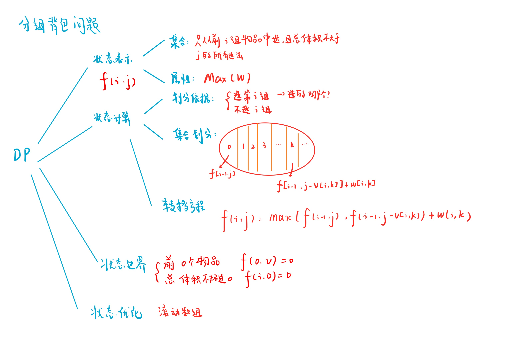

# 分组背包问题
[AcWing 9. 分组背包问题](https://www.acwing.com/problem/content/9/)

# 分组背包问题分析

$$f[i][j] = max(f[i-1][j],f[i-1][j-v[i][k]] + w[i][k])$$

# 分组背包问题模板
- 未降维
```cpp
#include <iostream>

using namespace std;

const int N = 12010;

int n, m;
int v[N][N], w[N][N], s[N];
int f[N][N];

int main()
{
    cin >> n >> m;

    for (int i = 1; i <= n; i ++)
    {
        cin >> s[i];
        for (int j = 1; j <= s[i]; j ++)
            cin >> v[i][j] >> w[i][j];
    }

    for (int i = 1; i <= n; i ++)
        for (int j = 0; j <= m; j ++)
        {
            f[i][j] = f[i - 1][j];
            for (int k = 1; k <= s[i]; k ++)
                if (v[i][k] <= j)
                    f[i][j] = max(f[i][j], f[i - 1][j - v[i][k]] + w[i][k]);
        }


    cout << f[n][m] << endl;
    return 0;
}
```

- 滚动数组降维
```cpp
#include <iostream>

using namespace std;

const int N = 12010;

int n, m;
int v[N][N], w[N][N], s[N];
int f[N];

int main()
{
    cin >> n >> m;

    for (int i = 1; i <= n; i ++)
    {
        cin >> s[i];
        for (int j = 1; j <= s[i]; j ++)
            cin >> v[i][j] >> w[i][j];
    }

    for (int i = 1; i <= n; i ++)
        for (int j = m; j >= 0; j --)
            for (int k = 1; k <= s[i]; k ++)
                if (v[i][k] <= j)
                    f[j] = max(f[j], f[j - v[i][k]] + w[i][k]);

    cout << f[m] << endl;
    return 0;
}
```