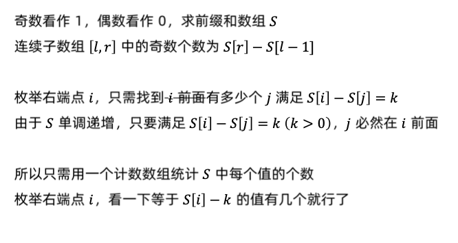

# 统计「优美子数组」
[LeetCode 1248. 统计「优美子数组」](https://leetcode.cn/problems/count-number-of-nice-subarrays/)

# 解题方法



# Code
```cpp
class Solution {
public:
    int numberOfSubarrays(vector<int>& nums, int k) {
        int n = nums.size();
        unordered_map<int, int> cnt;
        cnt[0] ++ ;
        int res = 0, sum = 0;
        for (auto x: nums) {
            if (x % 2) sum ++ ;
            res += cnt[sum - k];
            cnt[sum] ++ ;
        }
        return res;
    }
};
```
