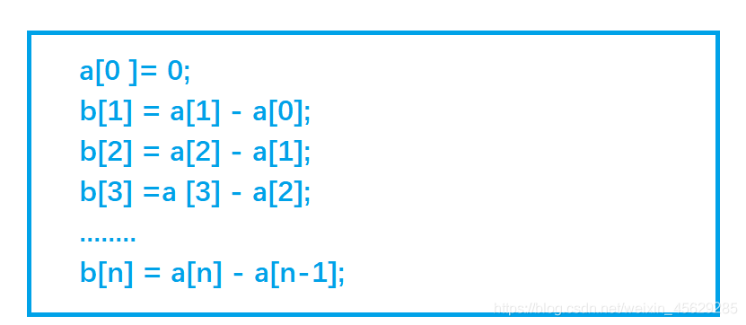

# Link
[AcWing 797. 差分](https://www.acwing.com/problem/content/799/)

# 一维差分模板
- **插入**
  将序列中 $[l, r]$ 之间的每个数都加上$c$
  ```cpp
  void insert(int b[], int l, int r, int c)
  {
      b[l] += c;
      b[r + 1] -=c;
  }
  ```
- 构造差分数组
  也可视作长度为1插入操作
  ```cpp
  void init_diff(int b[], int a[], int n)
  {
      for (int i = 1; i <= n; i ++)  
          insert(b, i, i, a[i]);
  }
  ```
  或者朴素地构造
  ```cpp
  void init_diff(int b[], int a[], int n)
  {
      for (int i = 1; i <= n; i++ ) 
          b[i] = a[i] - a[i - 1];
  }
  ```
- 求差分数组的前缀和，得到原数组
  ```cpp
  void update(int b[],int a[], int n)
  {
      for (int i = 1; i <= n; i ++) 
          a[i] = a[i - 1] + b[i];
  }
  ```

# 一维差分算法思路
**差分可以看成前缀和的逆运算**
差分数组：

首先给定一个原数组`a`：`a[1], a[2], a[3],,,,,, a[n];`
然后我们构造一个数组`b` : `b[1] ,b[2] , b[3],,,,,, b[i];`
使得 `a[i] = b[1] + b[2 ]+ b[3] +,,,,,, + b[i]`

也就是说，`a`数组是`b`数组的前缀和数组，反过来我们把b数组叫做a数组的差分数组。换句话说，每一个`a[i]`都是`b`数组中从头开始的一段区间和。

- 考虑如何构造差分`b`数组？
  - 最为直接的方法
    如下：
    `b[n] = a[n] - a[n-1];`
    
    
    
  - 或者看作长度为 $1$ 插入操作
- 知道了差分数组有什么用呢？
- 给定区间 $[l ,r ]$ ，让我们把 $a$ 数组中的 $[l, r]$ 区间中的每一个数都加上 $c$ 
  即 $a[l] + c$ , $a[l+1] + c$ , $a[l+2] + c$ .... $a[r] + c$
  - 首先让差分 $b$ 数组中的 $b[l] + c$ ,$a$ 数组变成 $a[l] + c$ ,$a[l+1] + c$ ... $a[n] + c$;
  - 然后我们打个补丁，$b[r+1] - c$, $a$ 数组变成 $a[r+1] - c$, $a[r+2] - c$ ... $a[n] - c$
- 图解：

  
  
  $b[l] + c$，效果使得 $a$ 数组中 $a[l]$ 及以后的数都加上了 $c$ (红色部分)，但我们只要求 $l$ 到 $r$ 区间加上 $c$, 因此还需要执行 $b[r+1] - c$,让 $a$ 数组中 $a[r+1]$ 及往后的区间再减去 $c$(绿色部分)，这样对于 $a[r]$ 以后区间的数相当于没有发生改变。

**因此我们得出一维差分结论**：
- 给 $a$ 数组中的 $[ l, r]$ 区间中的每一个数都加上 $c$ ,只需对差分数组 $b$ 做 `b[l] += c`, `b[r + 1] -= c` 时间复杂度为$O(1)$ , 大大提高了效率。

# Code
```cpp
#include <iostream>

using namespace std;

const int N = 100010;

int n, m;
int a[N], b[N];

void insert(int l, int r, int c)
{
    b[l] += c;
    b[r + 1] -= c;
}

int main()
{
    scanf("%d%d", &n, &m);
    for (int i = 1; i <= n; i ++ ) scanf("%d", &a[i]);

    for (int i = 1; i <= n; i ++ ) insert(i, i, a[i]);

    while (m -- )
    {
        int l, r, c;
        scanf("%d%d%d", &l, &r, &c);
        insert(l, r, c);
    }

    for (int i = 1; i <= n; i ++ ) b[i] += b[i - 1];

    for (int i = 1; i <= n; i ++ ) printf("%d ", b[i]);

    return 0;
}
```
简化版
```cpp
#include<iostream>
using namespace std;

const int N = 1e5 + 10;

int n, m;
int b[N];

void insert(int l, int r, int c)
{
    b[l] += c;
    b[r + 1] -= c;
}

int main()
{
    cin >> n >> m;
    for (int i = 1; i <= n; i ++)
    {
        int x;
        cin >> x;
        insert(i, i, x);
    }

    while (m--)
    {
        int l, r, c;
        cin >> l >> r >> c;
        insert(l, r, c);
    }

    for (int i = 1; i <= n; i ++)
    {
        b[i] = b[i - 1] + b[i];
        cout << b[i] << " ";
    }

    return 0;
}
```