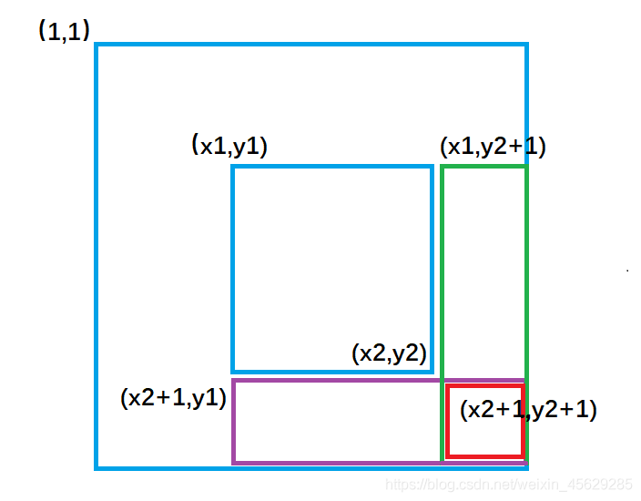
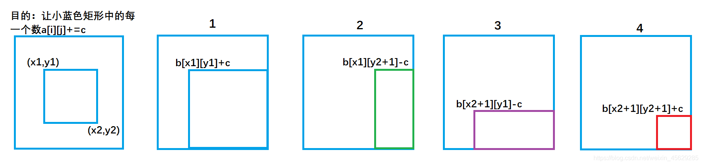

# Link
[AcWing 798. 差分矩阵](https://www.acwing.com/problem/content/800/)

# 二维差分模板
- **插入**
  将序列中 $[l, r]$ 之间的每个数都加上$c$
  ```cpp
  void insert(int b[N][N], int x1, int y1, int x2, int y2, int c)
  {
      b[x1][y1] += c;
      b[x2 + 1][y1] -= c;
      b[x1][y2 + 1] -= c;
      b[x2 + 1][y2 + 1] += c;
  }
  ```
- 构造差分数组
  也可视作长宽为 $1$ 插入操作
  ```cpp
  void init_diff(int b[], int a[], int n, int m)
  {
      for (int i = 1; i <= n; i ++ )
          for (int j = 1; j <= m; j ++ )
              insert(b, i, j, i, j, a[i][j]);
  }
  ```
  或者朴素地构造
  ```cpp
  void init_diff(int b[], int a[], int n)
  {
      for (int i = 1; i <= n; i++)
          for (int j = 1; j <= m; j++)
              b[i][j] = a[i][j] - a[i - 1][j] - a[i][j - 1] + a[i - 1][j - 1];
  }
  ```
 - 求差分矩阵的前缀和，更新原矩阵
   ```cpp
   void update(int b[],int a[], int n, int m)
   {
       for (int i = 1; i <= n; i ++) 
           for (int j = 1; j <= m; j ++)
               a[i][j] = a[i - 1][j] + a[i][j - 1] - a[i - 1][j - 1] + b[i][j];
   }
   ```

# 二维差分算法思路
如果扩展到二维，我们需要让二维数组被选中的子矩阵中的每个元素的值加上 $c$ ,是否也可以达到 $O(1)$ 的时间复杂度。答案是可以的，考虑二维差分。

`a[][]`矩阵是`b[][]`数组的前缀和矩阵，那么`b[][]`是`a[][]`的差分矩阵
原矩阵： `a[i][j]`
我们去构造差分矩阵： `b[i][j]`
使得 $a$ 矩阵中 `a[i][j]` 是 $b$ 数组左上角 $(1,1)$ 到右下角 $(i,j)$ 所包围矩形元素的和。

- 如何构造 $b$ 数组

- `b[x1][y1] += c` 对应图1 ,让整个 $a$ 数组中蓝色矩形面积的元素都加上了 $c$
- `b[x1][y2+1] -= c` 对应图2 ,让整个 $a$ 数组中绿色矩形面积的元素再减去 $c$，使其内元素不发生改变。
- `b[x2 + 1][y1] -= c` 对应图3 ,让整个 $a$ 数组中紫色矩形面积的元素再减去 $c$，使其内元素不发生改变。
- `b[x2 + 1][y2 + 1] += c` 对应图4 ,让整个 $a$ 数组中红色矩形面积的元素再加上 $c$，红色内的相当于**被减了两次**，再加上一次 $c$，才能使其恢复。


# 时间复杂度分析
$O(1)$

# Code
```cpp
#include <iostream>

using namespace std;

const int N = 1010;

int n, m, q;
int a[N][N], b[N][N];

void insert(int x1, int y1, int x2, int y2, int c)
{
    b[x1][y1] += c;
    b[x2 + 1][y1] -= c;
    b[x1][y2 + 1] -= c;
    b[x2 + 1][y2 + 1] += c;
}

int main()
{
    scanf("%d%d%d", &n, &m, &q);

    for (int i = 1; i <= n; i ++ )
        for (int j = 1; j <= m; j ++ )
            scanf("%d", &a[i][j]);

    for (int i = 1; i <= n; i ++ )
        for (int j = 1; j <= m; j ++ )
            insert(i, j, i, j, a[i][j]);

    while (q -- )
    {
        int x1, y1, x2, y2, c;
        cin >> x1 >> y1 >> x2 >> y2 >> c;
        insert(x1, y1, x2, y2, c);
    }

    for (int i = 1; i <= n; i ++ )
        for (int j = 1; j <= m; j ++ )
            b[i][j] += b[i - 1][j] + b[i][j - 1] - b[i - 1][j - 1];

    for (int i = 1; i <= n; i ++ )
    {
        for (int j = 1; j <= m; j ++ ) printf("%d ", b[i][j]);
        puts("");
    }

    return 0;
}
```