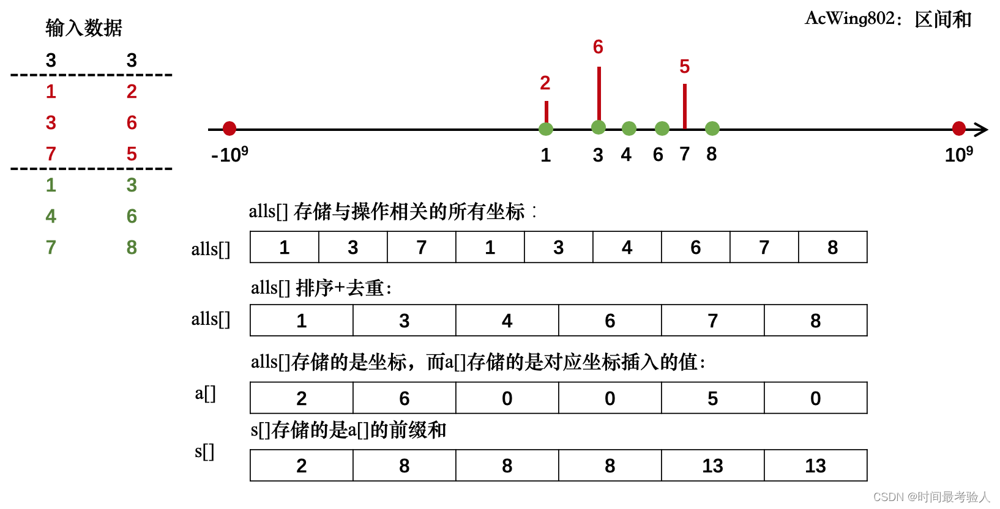
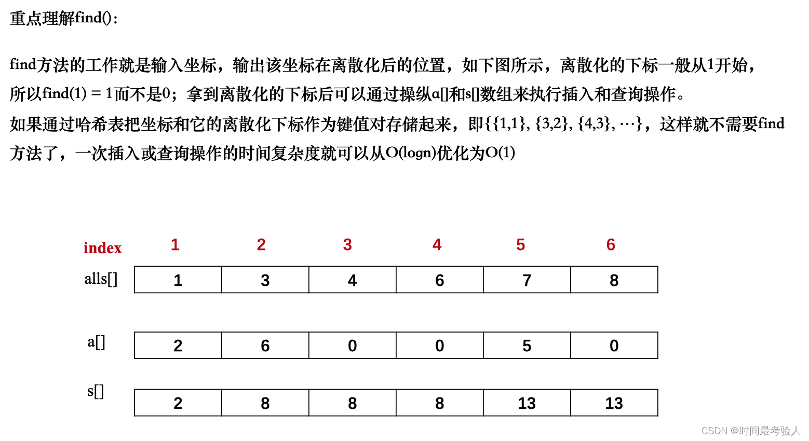

# 离散化
[AcWing 802. 区间和](https://www.acwing.com/problem/content/804/)

# 离散化模板
- 去重，返回去重后的下标
```cpp
vector<int>::iterator unique(vector<int> &a)
{
    int j = 0;
    for(int i = 0; i < a.size(); i ++)
        if(!i || a[i] != a[i - 1])
            a[j ++ ] = a[i];
    return a.begin() + j;
}
```
- 初始化离散化数组
  - 排序
  - 去重 
```cpp
void init_discretization(vectro<int> &alls)
{
    sort(alls.begin(), alls.end());
    alls.erase(unique(alls), alls.end());
}
```
- 获取映射后的下标
  - 手写二分 
  ```cpp
  int find(int x) 
  {  //二分查找
      int  l = 0, r = alls.size() - 1;
      while (l < r) 
      {
          int mid = l + r >> 1;
          if (alls[mid] >= x)
              r = mid;
          else
              l = mid + 1;
      }
      return r + 1; 
      //  因为要求前缀和，故下标从1开始方便，不用额外的再处理边界。
  }
  ```
  - STL
  ```cpp
  int find(int x)
  {
      return lower_bound(alls.begin(), alls.end(), x) - alls.begin() + 1;
  }
  ```

# 算法思路
- 思想
  **把无限空间中有限的个体映射到有限的空间中去，以此提高算法的时空效率。**

  通俗的说，离散化是在不改变数据相对大小的条件下，对数据进行相应的缩小。例如：

  - 原数据：$1,999,100000,15$
    处理后：$1,3,4,2$

  - 原数据：${100,200}，{20,50000}，{1,400}$
    处理后：${3,4}，{2,6}，{1,5}$
    
- 基本步骤
  - 用一个辅助的数组把你要离散的所有数据存下来
  - 排序，排序是为了后面的二分
  - 去重，因为我们要保证相同的元素离散化后数字相同
  - 索引，再用二分或map把离散化后的数字放回原数组

- 分析


# Code
```cpp
#include <iostream>
#include <cstring>
#include <algorithm>

#define x first
#define y second

using namespace std;

typedef pair<int, int> PII;
const int N = 3e5 + 10;
int a[N], s[N];
vector<PII> add, query; // 方便我们离散化还原数值，和区间查询操作
vector<int> alls; // 存储数值进行离散化操作
int n, m;

// 二分求出x对应的离散化的值
int find(int x) // 找到第一个大于等于x的位置
{    
    int l = 0, r = alls.size() - 1;
    while(l < r)
    {
        int mid = l + r >> 1;
        if(alls[mid] >= x) r = mid;
        else l = mid + 1;
    }
    return r + 1;
}

int main()
{
    cin >> n >> m;
    for (int i = 0; i < n; i ++ )
    {
        int x, c;
        cin >> x >> c;
        add.push_back({x, c});
        
        alls.push_back(x);
    }
    
    for (int i = 0; i < m; i ++ )
    {
        int l, r;
        cin >> l >> r;
        query.push_back({l, r});
        
        alls.push_back(l);
        alls.push_back(r);
    }
    
    // 排序 + 去重
    sort(alls.begin(), alls.end());
    alls.erase(unique(alls.begin(), alls.end()), alls.end());
    
    // 数值还原映射到a[]数组
    for(auto item : add)
    {
        int x = find(item.x);// 找到映射后的位置
        a[x] += item.y;// 插入数值
    }
    
    // 预处理前缀和
    for (int i = 1; i <= alls.size(); i ++ ) s[i] = s[i - 1] + a[i];
    
    // 处理区间和
    for(auto item : query)
    {
        // 找到离散化后对应的位置
        int l = find(item.x), r = find(item.y);
        cout << s[r] - s[l - 1] << endl; // 前缀和求区间和
    }
    
    return 0;
}
```