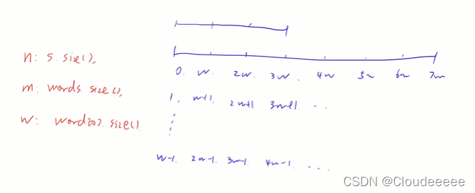

# 串联所有单词的子串 
[LeetCode 30. 串联所有单词的子串](https://leetcode.cn/problems/substring-with-concatenation-of-all-words/)

# 解法1
**分类枚举+滑动窗口**



思路：
- 划分区间，因为每个`word`的长度是相同的，因此可以将`s`串划分为从第$0$个元素开始匹配、从第$1$个元素开始匹配、… 、从第$w-1$个元素开始匹配的$w$种情况，这样就能保证给定的$words$串不会横跨区间。
- 在上述基础上，用一个哈希表`a`存储给定的 $m$ 个单词；用另一个哈希表`b`存储滑动窗口中的元素，每次滑动窗口时，只会在此哈希表中插入一个元素，再删除一个元素（键值对为 ---- 单词 ：单词出现的次数）
- 用`count`存储哈希表`b`中有多少个单词是哈希表`a`中的。如果窗口中出现过该单词，并且窗口中该单词的数量小于原单词组中的数量，则表示该单词有效，`cnt++` 最后，如果`count = m`，则得到一个答案。从而使得滑动窗口匹配子串时的时间复杂度降为$O(nw)$

### `total`和`window`里对`word`的加减关系
- 添加一个新单词到`window`里时
  - 如果该单词是有效单词：
    - 首先`window[word]--`;
    - 如果`window[word] <= total[word]`，证明该单词是有价值的，因为是先自增在判断。如果自增前该单词在`window`的数量已经达到了`total`的需求，自增后`window[word]`应该大于`total[word]`.所以如果自增后小于等于`total[word]`，证明该`word`的添加对结果有贡献作用`cnt++`;
    - 如果该单词是无效单词，则`total[word]`为$0$，所以自增后的`window[word] > total[word]`，`cnt`不自增。
    
      因此可以用`if(window[word] <= total[word]) cnt++`；来统一。
- 从`window`中删除`word`
  - 如果该单词是有效单词
    即删除该单词会导致删除后`window[word] < total[word]`。注意此处不能包括等于，假设我原来需要两个，你删之前有三个，删完之后有两个，这个被删除的依然不是必须的，所以必须`window[word]` 严格小于 `total[word]`才能使`cnt–`;
  - 如果该单词是无效单词。
    `total[word]`恒为$0$，删除后`window[word]`最差也为$0$.
    因此可以用`if(window[word] < total[word]) cnt–-;`来统一

### Code
```cpp
class Solution {
public:
    vector<int> findSubstring(string s, vector<string>& words) {
        vector<int> res;
        if (words.empty()) return res;
        int n = s.size(), m = words.size(), w = words[0].size();
        unordered_map<string, int> tot;
        for (auto& word : words) tot[word] ++ ;

        for (int i = 0; i < w; i ++ ) {
            unordered_map<string, int> wd;
            int cnt = 0;
            for (int j = i; j + w <= n; j += w) {
                if (j >= i + m * w) {
                    auto word = s.substr(j - m * w, w);
                    wd[word] -- ;
                    if (wd[word] < tot[word]) cnt -- ;
                }
                auto word = s.substr(j, w);
                wd[word] ++ ;
                if (wd[word] <= tot[word]) cnt ++ ;
                if (cnt == m) res.push_back(j - (m - 1) * w);
            }
        }

        return res;
    }
};
```

# 解法2
`words`长度固定，故匹配区域的长度也固定`words_cnt * words_len`

枚举固定长度的区间

看这个区间是否可以被匹配
- 以分割后的单词出现次数为标准统计`word : cnt`哈希映射
- 将窗口内的哈希映射与给定的哈希映射比较，相等则成功匹配

### Code
```cpp
class Solution {
public:
    bool is_equal(unordered_map<string, int> &m1, unordered_map<string, int> &m2)
    {
        for (auto &i : m1)
        {
            string key = i.first;
            int cnt = i.second;
            if (!m2.count(key) || m2[key] != cnt) return false;
        }
        for (auto &i : m2)
        {
            string key = i.first;
            int cnt = i.second;
            if (!m1.count(key) || m1[key] != cnt) return false;
        }
        return true;
    }
    
    vector<int> findSubstring(string s, vector<string>& words) {
        vector<int> res;
        unordered_map<string, int> tot_cnt;
        for (auto i : words) tot_cnt[i] ++;
        int words_cnt = words.size();
        int words_len = words[0].size();
        int pair_len = words_cnt * words_len;
        for (int i = 0; i + pair_len <= s.size(); i ++)
        {
            string pairStr = s.substr(i, pair_len);
            unordered_map<string, int> wd_cnt;
            for (int j = 0; j < words_cnt; j ++)
            {
                string splitStr = pairStr.substr(j * words_len, words_len);
                wd_cnt[splitStr] ++;
            }
            if (is_equal(tot_cnt, wd_cnt)) res.push_back(i);
        }
        return res;
    }
};
```

# 暴力
```cpp
class Solution {
public:
    vector<int> findSubstring(string s, vector<string>& words) {
    unordered_multiset<string> S;
    for (auto &i : words) S.insert(i);
    int words_cnt = words.size();
    int words_len = words[0].size();
    vector<int> res;
    
    for (int i = 0; i < words_len; i ++)
    {
        
        for (int j = i; j + words_len <= s.size(); j += words_len)
        {
            int cnt = 0;
            unordered_multiset<string> tmp = S;
            for (int k = 0, t = j; k < words_cnt && t + words_len <= s.size(); k ++)
            {
                string subs = s.substr(t, words_len);
                if (tmp.count(subs))
                {
                    cnt ++;
                    int p = tmp.count(subs);
                    tmp.erase(subs);
                    p--;
                    while (p --) tmp.insert(subs);
                }
                else break;
                t += words_len;
            }
            
            if (cnt == S.size()) res.push_back(j);
        }
    }
    return res;
}
};
```

