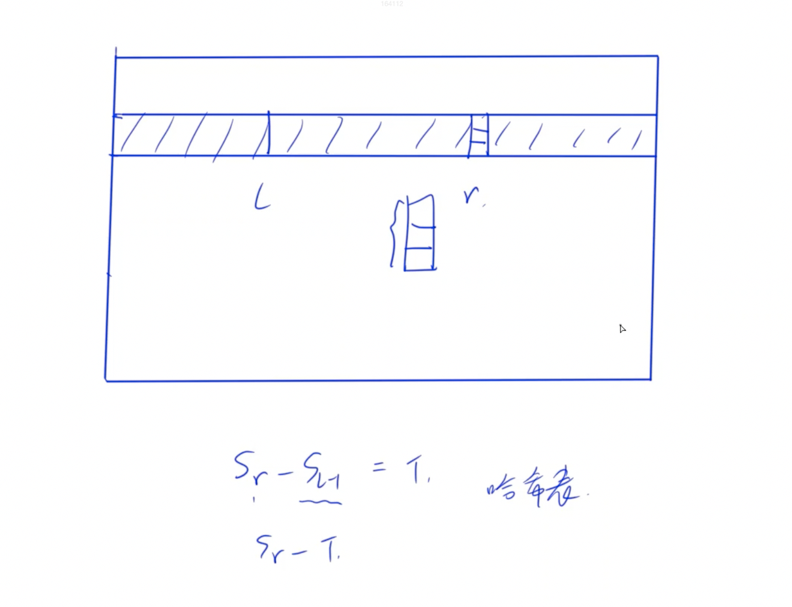

# LeetCode 1074. 元素和为目标值的子矩阵数量 
[LeetCode 1074. 元素和为目标值的子矩阵数量 ](https://leetcode.cn/problems/number-of-submatrices-that-sum-to-target/)

# 解法1
**二维前缀和 + 暴力枚举两个坐标**
时间复杂度: $O(N^4)$
### Code
```cpp
class Solution {
public:
    int numSubmatrixSumTarget(vector<vector<int>>& matrix, int target) {
    int n = matrix.size();
    int m = matrix[0].size();
    int res = 0;
    vector<vector<int>> s (n + 1, vector<int> (m + 1));
    for (int i = 1; i <= n; i ++)
        for (int j = 1; j <= m; j ++)
            s[i][j] = s[i - 1][j] + s[i][j - 1] - s[i - 1][j - 1] + matrix[i - 1][j - 1];

    for (int y1 = 1; y1 <= m; y1 ++)
        for (int y2 = y1; y2 <= m ; y2 ++)
            for (int x1 = 1; x1 <= n; x1 ++)
                for (int x2 = x1; x2 <= n; x2 ++)
                {
                    int ans = s[x2][y2] - s[x1 - 1][y2] - s[x2][y1 - 1] + s[x1 - 1][y1 - 1];
                    if (ans == target) res ++;
                }

    return res;
    }
};
```
# 解法2
在固定了行之后计算前缀，同时维护一个哈希表，同时用子矩阵左右两边的位置关系和他们的差与`target`的关系减少了一层复杂度

- 在矩阵中，对每行数字求前缀和。
- 枚举上下边界 `i` 和 `j`，确定了上下边界后，我们可以将其化简一维数组的问题：**即给定一个一维数组，求其中子数组为 `target` 的个数**
- 一维的问题可以通过**哈希表**和**前缀和**解决：
  - 前$0$个前缀和为$0$，初始化哈希表 $0$ 出现的次数为 $1$ 次
  - 遍历数组，每次求出当前位置的前缀和 $sum$，若存在子段区间和为$target$, 则对于该字段右边界$r$存在一个左边界$l$，使得$S_r(sum)-S_{l-1}=target$, 所以累计哈希表中 $sum - target$ 出现的次数，最后 `sum` 的次数加 $1$
  - 之所以可以用哈希表来直接查询 $S_{l-1}$ 是因为 $S_{l-1}$ 必定在 $S_r(sum)$ 的右边，而之前当 $S_{l-1}$ 作为左边界时，已经加入哈希表，故每次都可以查询到




# Code
```cpp
class Solution {
public:
    int numSubmatrixSumTarget(vector<vector<int>>& g, int target) {
        int n = g.size(), m = g[0].size();
        vector<vector<int>> s(n + 1, vector<int>(m + 1));
        for (int i = 1; i <= n; i ++ )
            for (int j = 1; j <= m; j ++ )
                s[i][j] = s[i - 1][j] + g[i - 1][j - 1];

        int res = 0;
        for (int i = 1; i <= n; i ++ )
            for (int j = i; j <= n; j ++ ) {
                unordered_map<int, int> cnt;
                cnt[0] ++ ;
                for (int k = 1, sum = 0; k <= m; k ++ ) {
                    sum += s[j][k] - s[i - 1][k];
                    res += cnt[sum - target];
                    cnt[sum] ++ ;
                }
            }

        return res;
    }
};
```