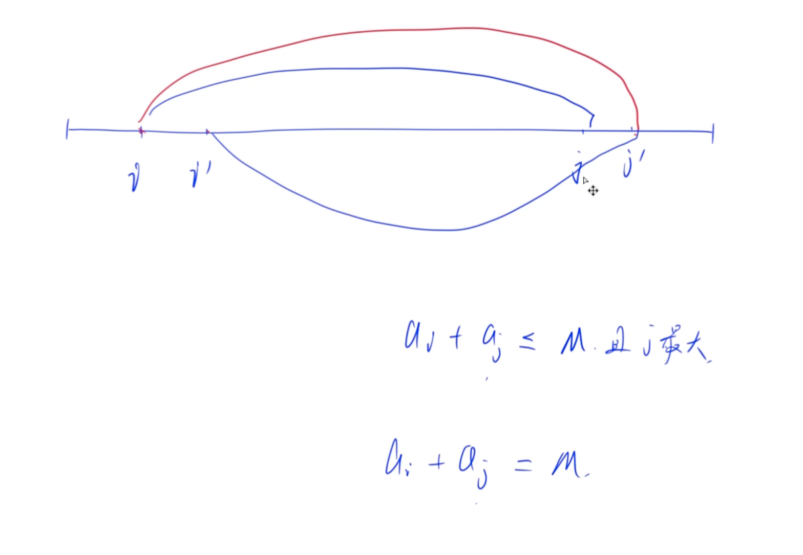

# 找硬币
[AcWing 1532. 找硬币](https://www.acwing.com/activity/content/problem/content/2180/)

# 解题思路1
哈希表——两数之和

### Code
```cpp
#include <iostream>
#include <algorithm>
#include <unordered_set>
#include <vector>
using namespace std;

unordered_set<int> coins;
int n, m;

int main()
{
    vector<pair<int, int>> res;
    cin >> n >> m;
    while (n --)
    {
        int x;
        scanf("%d", &x);
        int val = m - x;
        if (coins.count(val)) res.push_back({min(val, x), max(val, x)});
        coins.insert(x);
    }
    if (res.empty()) puts("No Solution");
    else
    {
        sort(res.begin(), res.end());
        cout << res[0].first << ' ' << res[0].second;
    }
    return 0;
}
```
- 同步更新答案
```cpp
#include <iostream>
#include <unordered_set>

using namespace std;

int main()
{
    int n, m;
    cin >> n >> m;

    unordered_set<int> S;
    int v1 = 1e9, v2;
    for (int i = 0; i < n; i ++ )
    {
        int x;
        cin >> x;
        int y = m - x;
        if (S.count(y))
        {
            S.insert(x);
            if (x > y) swap(x, y);
            if (x < v1) v1 = x, v2 = y;
        }
        else S.insert(x);
    }

    if (v1 == 1e9) puts("No Solution");
    else cout << v1 << ' ' << v2 << endl;

    return 0;
}
```

# 解题思路2
双指针


### Code
```cpp
#include <iostream>
#include <cstring>
#include <algorithm>

using namespace std;

const int N = 100010;

int n, m;
int w[N];

int main()
{
    scanf("%d%d", &n, &m);
    for (int i = 0; i < n; i ++ ) scanf("%d", &w[i]);
    sort(w, w + n);

    for (int i = 0, j = n - 1; i < j; i ++ )
    {
        while (i < j && w[i] + w[j] > m) j -- ;
        if (i < j && w[i] + w[j] == m)
        {
            printf("%d %d\n", w[i], w[j]);
            return 0;
        }
    }

    puts("No Solution");
    return 0;
}
```
