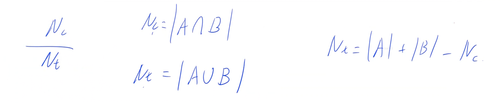
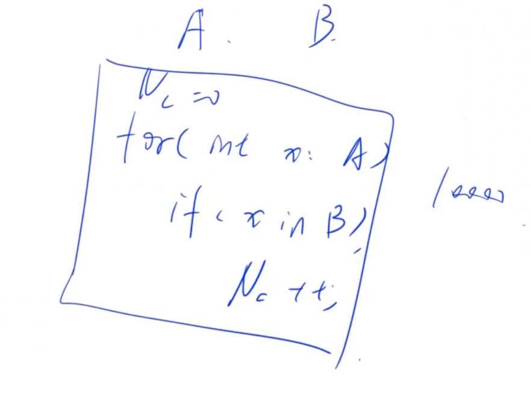

# 集合相似度 
[AcWing 1549. 集合相似度](https://www.acwing.com/problem/content/description/1551/)

# 解题思路
**容斥原理**




- 注意点：
  关于`set`合并，简单点就用`s.insert(st[b].begin(),st[b].end());`
  `set`中`insert`的时间复杂度是$O(logn)$，遍历一次即是$O(nlogn)$

```cpp
set<int> s=st[a];
s.insert(st[b].begin(),st[b].end());
```

# Code
```cpp
#include <iostream>
#include <unordered_set>

using namespace std;

const int N = 55;

int n;
unordered_set<int> S[N];

int main()
{
    scanf("%d", &n);

    for (int i = 1; i <= n; i ++ )
    {
        int m;
        scanf("%d", &m);
        while (m -- )
        {
            int x;
            scanf("%d", &x);
            S[i].insert(x);
        }
    }

    int k;
    scanf("%d", &k);
    while (k -- )
    {
        int a, b;
        scanf("%d%d", &a, &b);
        int nc = 0;
        for (auto x : S[a]) nc += S[b].count(x);
        int nt = S[a].size() + S[b].size() - nc;
        printf("%.1lf%%\n", (double)nc / nt * 100);
    }

    return 0;
}
```

- 手写哈希表
```cpp
#include <iostream>
#include <algorithm>
#include <vector>
#include <cstring>
using namespace std;

int n, m;

const int N = 10003;

//开放寻址法
struct unordered_set1{
    const int null = 0x3f3f3f3f;
    int h[N];
    vector<int> data;

    unordered_set()
    {
        memset(h, 0x3f, sizeof h);
    }

    int find(int x)
    {
        int k = (x % N + N) % N;
        while (h[k] != null && h[k] != x)
        {
            k ++;
            if (k == N) k = 0;
        }
        return k;
    }

    bool count(int x)
    {
        return h[find(x)] != null;
    }

    void insert(int x)
    {
        if (count(x)) return;
        h[find(x)] = x;
        data.push_back(x);
    }

};

//拉链法
struct unordered_set2{
    
    int h[N], e[N], ne[N], idx;
    vector<int> data;

    unordered_set()
    {
        memset(h, -1, sizeof h);
        memset(e, 0, sizeof e);
        memset(ne, 0, sizeof ne);
        idx = 0;
    }

    bool count(int x)
    {
        int k = (x % N + N) % N;
        for (int i = h[k]; i != -1; i = ne[i])
            if (e[i] == x) return true;
        return false;
    }
    
    void insert(int x)
    {
        if (count(x)) return;
        int k = (x % N + N) % N;
        e[idx] = x, ne[idx] = h[k], h[k] = idx ++;
        data.push_back(x);
    }

};

int main()
{
    vector<unordered_set> sets;
    cin >> n;
    while (n --)
    {
        unordered_set cur_set;
        int x;
        scanf("%d", &x);
        while (x --)
        {
            int t;
            scanf("%d", &t);
            cur_set.insert(t);
        }
        sets.push_back(cur_set);
    }
    cin >> m;
    while (m --)
    {
        int a, b;
        scanf("%d%d", &a, &b);
        double x = 0, y = 0;
        auto &s1 = sets[a - 1];
        auto &s2 = sets[b - 1];
        for (auto i : s1.data)
        {
            y ++;
            if (!s2.count(i)) x ++;
        }

        for (auto i : s2.data)
        {
            if (!s1.count(i)) x ++, y ++;
        }
        x = y - x;
        double res = x / y * 100;
        printf("%.1lf%%\n", res);
    }

    return 0;
}
```
- STL
```cpp
#include <iostream>
#include <algorithm>
#include <unordered_set>
#include <vector>
using namespace std;

int n, m;

int main()
{
    vector<unordered_set<int>> sets;
    cin >> n;
    while (n --)
    {
        unordered_set<int> cur_set;
        int x;
        scanf("%d", &x);
        while (x --)
        {
            int t;
            scanf("%d", &t);
            cur_set.insert(t);
        }
        sets.push_back(cur_set);
    }
    cin >> m;
    while (m --)
    {
        int a, b;
        scanf("%d%d", &a, &b);
        double x = 0, y = 0;
        auto &s1 = sets[a - 1];
        auto &s2 = sets[b - 1];
        for (auto &i : s1)
        {
            y ++;
            if (!s2.count(i)) x ++;
        }
        for (auto &i : s2)
        {
            if (!s1.count(i)) x ++, y ++;
        }
        x = y - x;
        double res = x / y * 100;
        printf("%.1lf%%\n", res);
    }
    return 0;
}
```