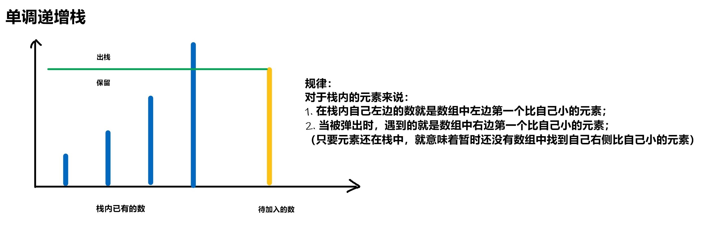

# 单调栈
[AcWing 830. 单调栈](https://www.acwing.com/problem/content/832/)

# 单调栈原理
剔除不可能成为答案的元素，从而对朴素算法进行加速

### 套路
  确定单调增减
  
  关键在于考虑**前面无法影响后面的条件** 
  
  破坏单调性时，有哪些答案可以舍弃（`pop`），或者是可以找到一个解，求解的过程中**修改无后续性的元素**使栈单调

### 模型
离某个元素左（右）边的最小（大）值




### 性质
不可能成为答案的元素：
$i < j, a_i > a_j$
如果$a_i$可以成为答案则
$x > a_i > a_j$
$x > a_j$
但 $j$ 在 $i$ 的左边，则 $a_j$ 是更好的答案
若维护一个单调栈，则这些逆序的元素会被排除在外，且根据单调性，栈顶元素即为答案

### 模板
```cpp
int tt = 0;
for (int i = 1; i <= n; i ++ )
{
    while (tt && check(stk[tt], i)) tt -- ;
    ...
    stk[ ++ tt] = i;
}
```

# Code
```cpp
#include <iostream>

using namespace std;

const int N = 10010;

int q[N], tt;

int main()
{
    int n;
    cin >> n;
    while (n --)
    {
        int x;
        cin >> x;
        while (tt && q[tt] >= x) tt --;
        if (tt == 0) cout << -1 << ' ';
        else cout << q[tt] << ' ';
        q[++ tt] = x;
    }
    return 0;
}
```