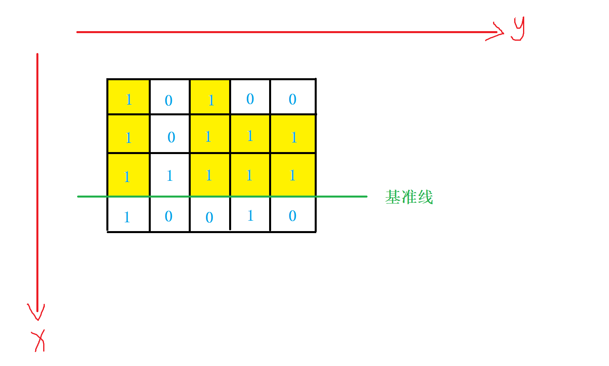

# 最大矩形
[LeetCode 85. 最大矩形](https://leetcode.cn/problems/maximal-rectangle/)

# 解题思路



将 **柱状图中最大矩形** 问题扩展到二维。

一行一行考虑，类比柱状图中最大矩形，一行内所有柱形条的高度 `heights` 就是当前 $(i, j)$ 位置能往上延伸的最大高度
- 若当前位置是$0$，则$h[i,j] = 0$
- 若当前位置是$1$，则$h[i,j] = 1 + h[i-1,j]$

直接套用柱状图中最大矩形的单调栈算法即可。

# Code
```cpp
class Solution {
public:
    int maximalRectangle(vector<vector<char>>& matrix) {
        int x_len = matrix.size();
        int y_len = matrix[0].size();
        vector<int> h(y_len);
        int ans = 0;
        
        for (int i = 0; i < x_len; i ++)
        {
            vector<int> l(y_len);
            vector<int> r(y_len);
            stack<int> stk;
            
            //获取柱状图的高度
            for (int j = 0; j < y_len; j ++)
                if (matrix[i][j] == '1') h[j] += 1;
                else h[j] = 0;
            
            //获取左侧能扩展的最大长度
            for (int j = 0; j < y_len; j ++)
            {
                while (stk.size() && h[stk.top()] >= h[j])
                    stk.pop();
                if (stk.size()) l[j] = stk.top();
                else l[j] = -1;
                stk.push(j);
            }
            stk = stack<int>();
            
            //获取右侧能扩展的最大长度
            for (int j = y_len - 1; j >= 0; j --)
            {
                while (stk.size() && h[stk.top()] >= h[j])
                    stk.pop();
                if (stk.size()) r[j] = stk.top();
                else r[j] = y_len;
                stk.push(j);
            }
            
            //更新答案
            for (int j = 0; j < y_len; j ++)
            {
                int area = h[j] * (r[j] - l[j] - 1);
                ans = max(ans, area);
            }
        }
        return ans;
    }
};
```

```cpp
class Solution {
public:
    int largestRectangleArea(vector<int>& h) {
        int n = h.size();
        vector<int> left(n), right(n);
        stack<int> stk;

        for (int i = 0; i < n; i ++ ) {
            while (stk.size() && h[stk.top()] >= h[i]) stk.pop();
            if (stk.empty()) left[i] = -1;
            else left[i] = stk.top();
            stk.push(i);
        }

        stk = stack<int>();
        for (int i = n - 1; i >= 0; i -- ) {
            while (stk.size() && h[stk.top()] >= h[i]) stk.pop();
            if (stk.empty()) right[i] = n;
            else right[i] = stk.top();
            stk.push(i);
        }

        int res = 0;
        for (int i = 0; i < n; i ++ ) {
            res = max(res, h[i] * (right[i] - left[i] - 1));
        }

        return res;
    }

    int maximalRectangle(vector<vector<char>>& matrix) {
        if (matrix.empty() || matrix[0].empty()) return 0;
        int n = matrix.size(), m = matrix[0].size();

        vector<vector<int>> h(n, vector<int>(m));
        for (int i = 0; i < n; i ++ )
            for (int j = 0; j < m; j ++ ) {
                if (matrix[i][j] == '1') {
                    if (i) h[i][j] = 1 + h[i - 1][j];
                    else h[i][j] = 1;
                }
            }

        int res = 0;
        for (int i = 0; i < n; i ++ ) res = max(res, largestRectangleArea(h[i]));

        return res;
    }
};
```