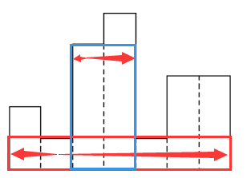
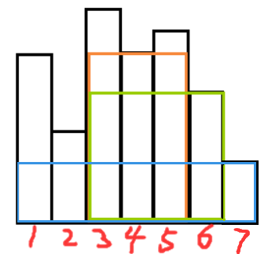

# 柱状图中最大矩形
[AcWing 131. 直方图中最大的矩形](https://www.acwing.com/problem/content/description/133/)
[LeetCode 84. 柱状图中最大的矩形](https://leetcode.cn/problems/largest-rectangle-in-histogram/)

# 解题思路
- 暴力做法
  以每个矩形的高度为准，向两边扩展，直到遇到比它矮的为止
  

  如图所示，记录每个矩形向两侧扩展的边界 $[l,r]$
  
  它扩展出的矩形面积为 $s=(r−l+1)∗h$

  最优解会在这些扩展出的矩形中产生。

- 单调栈优化
  在计算每个矩形可以扩展的左边界时，可以发现有一些矩形是可以不考虑的
  
  
  如图所示，由于2号矩形的存在，在计算2右边的矩形的左边界时，可以不考虑1号矩形。

  高度高于$2$号的矩形会被$2$卡住，高度小于等于$2$号的也必然小于等于$1$号。

  观察可知，在计算左边界时，靠左的且较高的矩形可以省略，因此可以用单调栈优化。

  `q[tt]`作为栈顶元素下标，当满足`h[q[tt]] >= h[i]`时，弹出栈顶


# Code
```cpp
#include<iostream>
#include<algorithm>

using namespace std;

const int N = 100010;

//l[i], r[i]表示第i个矩形的高度可向两侧扩展的左右边界
int h[N], q[N], l[N], r[N];

typedef long long LL;

int main()
{
    int n;
    while(scanf("%d", &n), n)
    {
        for(int i = 1; i <= n; i ++)  scanf("%d", &h[i]);
        h[0] = h[n + 1] = -1;

        int tt = -1;
        q[++ tt] = 0;
        for(int i = 1; i <= n; i ++)
        {
            while (h[q[tt]] >= h[i])  tt --;
            l[i] = i - q[tt];
            q[++ tt] = i;
        }

        tt = -1;
        q[++ tt] = n + 1;
        for(int i = n; i; i --)
        {
            while (h[q[tt]] >= h[i])  tt --;
            r[i] = q[tt] - i;
            q[++ tt] = i;
        }

        LL res = 0;
        for(int i = 1; i <= n; i ++)  res = max(res, (LL)h[i] * (l[i] + r[i] - 1));
        printf("%lld\n", res);
    }
    return 0;
}

```
- LeetCode
```cpp
class Solution {
public:
    int largestRectangleArea(vector<int>& h) {
        int n = h.size();
        vector<int> left(n), right(n);
        stack<int> stk;

        for (int i = 0; i < n; i ++ ) {
            while (stk.size() && h[stk.top()] >= h[i]) stk.pop();
            if (stk.empty()) left[i] = -1;
            else left[i] = stk.top();
            stk.push(i);
        }

        stk = stack<int>();
        for (int i = n - 1; i >= 0; i -- ) {
            while (stk.size() && h[stk.top()] >= h[i]) stk.pop();
            if (stk.empty()) right[i] = n;
            else right[i] = stk.top();
            stk.push(i);
        }

        int res = 0;
        for (int i = 0; i < n; i ++ ) {
            res = max(res, h[i] * (right[i] - left[i] - 1));
        }

        return res;
    }
};
```
- my
```cpp
class Solution {
public:

    struct rec{
        int idx;
        int h;
    };
    
    int largestRectangleArea(vector<int>& heights) {
        int s = heights.size();
        stack<rec> l, r;
        vector<rec> l_res(s), r_res(s);

        for (int i = 0; i < heights.size(); i ++)
        {
            int h = heights[i];
            while (!l.empty() && l.top().h >= h) l.pop();
            if (!l.empty()) l_res[i] = l.top();
            else l_res[i] = {-1, h};
            l.push({i, h});
        }
        
        for (int i = heights.size() - 1; i >= 0; i --)
        {
            int h = heights[i];
            while (!r.empty() && r.top().h >= h) r.pop();
            if (!r.empty()) r_res[i] = r.top();
            else r_res[i] = {(int)heights.size(), h};
            r.push({i, h});
        }
        
        int res = -1;
        for (int i = 0; i < heights.size(); i ++)
        {
            int area = (r_res[i].idx - l_res[i].idx - 1) * heights[i];
            res = max(area, res);
        }
        return res;
    }
};
```

