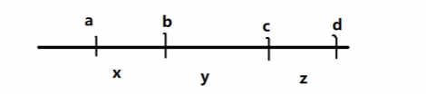

# 括号画家
[AcWing 150. 括号画家](https://www.acwing.com/problem/content/152/)

# 解题思路
使用一个栈，从左向右扫描整个字符串
- 遇到左括号，则入栈
- 遇到右括号，看一下栈顶是不是对应的左括号，是的话就出栈，不是就入栈

### 证明
有没有可能两个有交集区间的合法区间的并集不合法？
也就是说，最大合法区间的长度是否与起点的选取有关？

将合法序列的左括号替换为 $1$ ，右括号为 $-1$ ，$cnt$ 为该序列前缀和
合法括号序列的充要条件
- 匹配过程中，$所有前缀中左括号的数量 >= 右括号的数量，所以cnt>=0$
- 完全匹配后，$左括号数量=右括号数量，所以cnt=0$

**证明：$[a,c]$ 与 $[b,d]$ 合法，则 $[a,d]$ 一定合法**



$$
\left\{\begin{matrix} 
  x + y = 0 \\  
  x \ge  0
\end{matrix}\right.
$$
$$
\left\{\begin{matrix} 
  y + z = 0 \\  
  y \ge  0
\end{matrix}\right. 
$$

$$
\Rightarrow x=z=y=0
$$
$$
x,y,z三段均合法，[a,d]段合法
$$

# Code

- 构造 $01$ 序列 $1$ 代表不删除，$0$ 代表删除，再用双指针扫描 $0$ 的连续区间
- 栈中存符号

#### 注意：
在扫描的过程中，所有合法的括号序列一定会被删除掉（匹配出栈）
所以全部删除完之后当前元素索引值与栈顶元素索引值之差就是对应的最长的合法序列


```cpp
#include <iostream>
#include <unordered_map>
#include <unordered_set>
#include <stack>
#include <vector>

using namespace std;

unordered_set<char> lp =
{
        '(', '[', '{'
};

unordered_map<char, char> rp =
{
        {')', '('},
        {']', '['},
        {'}', '{'}
};

int main()
{
    string s;
    cin >> s;
    stack<char> stk;
    vector<int> id;
    int ans = 0;
    
    for (auto c : s)
    {
        if (lp.count(c)) //左括号
        {
            stk.push(c);
            id.push_back(1);
        }
        else //右括号
        {
            if (!stk.size()) //单有一个右括号
            {
                stk.push(c);
                id.push_back(1);
                continue;
            }
            if (stk.top() == rp[c]) //右括号匹配
            {
                stk.pop();
                int t = 0;
                while (id.back() == 0) id.pop_back(), t ++;
                id.pop_back();
                id.push_back(0);
                id.push_back(0);
                while (t --) id.push_back(0);
            }
            else //右括号不匹配
            {
                stk.push(c);
                id.push_back(1);
            }
        }
    }
    
    //扫描0的连续区间
    for (int i = 0; i < id.size(); i ++)
    {
        while (id[i] == 1) i ++;
        int j = i, cnt = 0;
        while (j < id.size() && id[j] == 0) j ++, cnt ++;
        ans = max(ans, cnt);
        i = j - 1;
    }
    cout << ans;
    return 0;
}
```
- 每次处理完一个字符后，就计算一下合法序列的长度，更新一下最大结果`res`
- 栈中存下标，方便计算删掉的区间长度 `i - stk.top()`

```cpp
#include <stack>
#include <cstdio>
#include <iostream>

using namespace std;

int main()
{
    string str;
    cin >> str;
    stack<int> stk;

    int res = 0;
    for (int i = 0; i < str.size(); i ++ )//当前枚举到哪个括号
    {
        if (stk.size())//如果当前栈里非空
        {
            int t = str[stk.top()];//若栈顶括号与当前枚举的括号配对，则删除栈顶元素
            if (t == '(' && str[i] == ')' || t == '[' && str[i] == ']' || t == '{' && str[i] == '}') stk.pop();
            else stk.push(i);//若不配对，则将当前枚举的括号加入
        }
        else stk.push(i);//若栈为空则直接加入概括好

        if (stk.size()) res = max(res, i - stk.top());//当前枚举的位置与栈顶的距离即为删除的元素的个数即连续括号的长度
        else res = max(res, i + 1);//否则栈顶为空说明之前枚举的所有的括号都合法，因为下标从0开始，所以要加1
    }

    cout << res << endl;

    return 0;
}
```