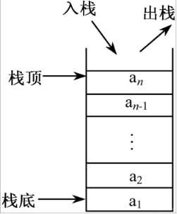

# 模拟栈
[AcWing 828. 模拟栈](https://www.acwing.com/problem/content/830/)

# 栈
### 操作
- 初始化
```cpp
int stk[N];
int tt = 0;
```
- 栈顶加入元素,从下标1开始加入
```cpp
void push(int x)
{
    tt ++;
    stk[tt] = x;
}
```
- 栈顶弹出元素
```cpp
void pop()
{
    tt --;
}
```

- 是否为空，如果tt是0，则为空
```cpp
bool empty()
{
    if (tt > 0) return false;
    else return true;
}
```

- 访问栈顶元素
```cpp
int top()
{
    return stk[tt];
}
```

- 元素个数
```cpp
bool size()
{
    return tt;
}
```

### 特点
**先进后出**



### 应用
具有**最近相关性**
在数据的一端进行操作

# Code
- 数组模拟的优势：支持随机访问
- 速度快
```cpp
struct stack
{
    int data[N];
    int tt = 0;
    
    bool empty() const
    {
        return !tt;
    }
    
    bool size() const
    {
        return tt;
    }
    
    void pop()
    {
        tt --;
    }
    
    void push(int x)
    {
        data[++ tt] = x;
    }
    
    int top()
    {
        return data[tt];
    }
    
    int &operator[](int i)
    {
        return data[i];
    }
    
};
```
```cpp
#include <iostream>

using namespace std;

const int N = 10010;

int q[N], tt = 0;

int m;

int main()
{
    cin >> m;
    while (m --)
    {
        string op;
        cin >> op;
        if (op == "push")
        {
            int x;
            cin >> x;
            q[++ tt] = x;
        }
        else if (op == "pop") tt --;
        else if (op == "empty")
        {
            if (tt == 0) cout << "YES" << endl;
            else cout << "NO" << endl;
        }
        else if (op == "query") cout << q[tt] << endl;
    }
    return 0;
}
```

