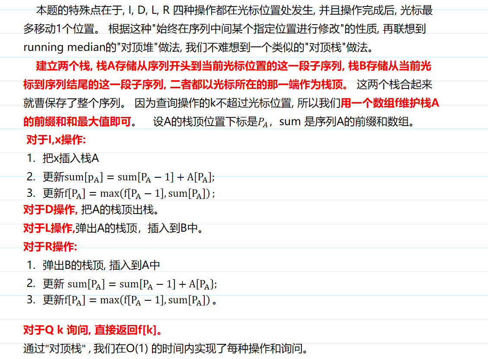

# 编辑器
[AcWing 128. 编辑器](https://www.acwing.com/problem/content/130/)

# 解题思路
### 对顶栈
仅涉及在两组数据的单边进行操作，考虑栈




# Code
```cpp
#include <iostream>
#include <limits.h>

using namespace std;

const int N = 1000010;

int stkl[N], stkr[N], topl, topr;
int f[N], sum[N];

void add(int x)
{
    stkl[ ++ topl] = x;
    sum[topl] = sum[topl - 1] + x;
    f[topl] = max(f[topl - 1], sum[topl]);
}

int main()
{
    int n;
    scanf("%d", &n);
    char ops[2]; //读字符串，不用特判空格与回车
    f[0] = INT_MIN;
    while (n -- )
    {
        int x;
        scanf("%s", ops);
        if (*ops == 'I')
        {
            scanf("%d", &x);
            add(x);
        }
        else if (*ops == 'D')
        {
            if (topl) topl -- ;
        }
        else if (*ops == 'L')
        {
            if (topl) stkr[ ++ topr] = stkl[topl -- ];
        }
        else if (*ops == 'R')
        {
            if (topr) add(stkr[topr -- ]);
        }
        else
        {
            scanf("%d", &x);
            printf("%d\n", f[x]);
        }
    }
    return 0;
}
```

- 可随机访问的`stack`
```cpp
#include <iostream>
#include <cstdio>

using namespace std;

const int N = 1000010;

struct stack
{
    int data[N] = {0};
    int tt = 0;
    
    bool empty() const
    {
        return !tt;
    }
    
    bool size() const
    {
        return tt;
    }
    
    void pop()
    {
        tt --;
    }
    
    void push(int x)
    {
        data[++ tt] = x;
    }
    
    int top()
    {
        return data[tt];
    }
    
    int &operator[](int i)
    {
        return data[i];
    }
    
};

stack stk1, stk2;
stack preSum, preSumMax;


int main()
{
    int n, cnt = 0;
    cin >> n;
    while (n --)
    {
        
        char op;
        getchar();
        scanf("%c", &op);
        
        if (op == 'I')
        {
            int x;
            scanf("%d", &x);
            stk1.push(x);
            if (preSum.size())
            {
                preSum.push(preSum.top() + x);
                preSumMax.push(max(preSum.top(), preSumMax.top()));
            }
            else
            {
                preSum.push(x);
                preSumMax.push(x);
            }
        }
        else if (op == 'D')
        {
            if (stk1.empty()) continue;
            stk1.pop();
            preSum.pop();
            preSumMax.pop();
        }
        else if (op == 'L')
        {
            if (stk1.empty()) continue;
            int t = stk1.top();
            stk1.pop();
            stk2.push(t);
            preSum.pop();
            preSumMax.pop();
        }
        else if (op == 'R')
        {
            if (stk2.empty()) continue;
            int t = stk2.top();
            stk2.pop();
            stk1.push(t);
            if (preSum.size())
            {
                preSum.push(preSum.top() + t);
                preSumMax.push(max(preSum.top(), preSumMax.top()));
            }
            else
            {
                preSum.push(t);
                preSumMax.push(t);
            }
        }
        else if (op == 'Q')
        {
            int k;
            scanf("%d", &k);
            cout << preSumMax[k] << endl;
        }
        
    }
    return 0;
}
```