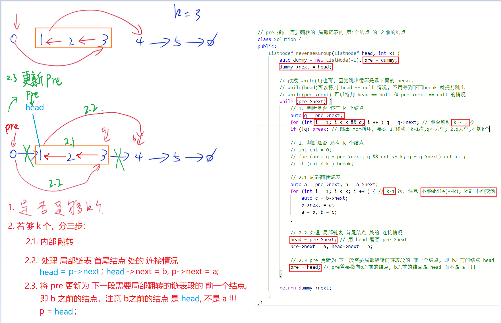

# k个一组翻转链表
[k个一组翻转链表](https://leetcode.cn/problems/reverse-nodes-in-k-group/)

# 解题思路
- 分组遍历
  每组$k$个，往后走$k-1$步找到一组 `getEnd()`
  - 开头`head` 结尾`end`
- 每组内部操作
  - 翻转链表 `reverseList(head, nextGroupHead)`
- 更新每组与前一组与后一组的边  
  - 前一组的尾节点`last.next`更新为end
  - 当前组的`head->next`更新为下一组的头节点`nextGroupHead` 
- 更新当前组与下一组
  - `last = head`
  - `head = nextGroupHead` 



# Code
```cpp
/**
 * Definition for singly-linked list.
 * struct ListNode {
 *     int val;
 *     ListNode *next;
 *     ListNode() : val(0), next(nullptr) {}
 *     ListNode(int x) : val(x), next(nullptr) {}
 *     ListNode(int x, ListNode *next) : val(x), next(next) {}
 * };
 */
class Solution {
public:
    ListNode* reverseKGroup(ListNode* head, int k) {
        ListNode* dummy = new ListNode(-1);
        dummy->next = head;
        auto last = dummy;
        auto cur = head;
        //分组遍历
        while (cur != nullptr)
        {
            //分组，不够分就不管
            auto end = getEnd(cur, k);
            if (end == nullptr) break;

            //翻转链表
            auto nextGroupHead = end->next;
            reverseList(cur, nextGroupHead);

            //更新每组与前一组与后一组的边
            last->next = end;
            cur->next = nextGroupHead;

            //更新当前组与下一组
            last = cur;
            cur = nextGroupHead;
        }
        return dummy->next;
    }
    
    void reverseList(ListNode* start, ListNode* stop)
    {
        auto pre = start;
        auto cur = start->next;
        while (cur != stop)
        {
            auto nextNode = cur->next;
            cur->next = pre;
            pre = cur, cur = nextNode;
        }
    }

    ListNode* getEnd(ListNode* start, int k)
    {
        for (auto cur = start; cur != nullptr; cur = cur->next)
            if (-- k == 0) return cur;
        
        return nullptr;
    }
};
```
- 简化版
```cpp
// pre 指向 需要翻转的 局部链表的 第1个结点 的 之前的结点
class Solution {
public:
    ListNode* reverseKGroup(ListNode* head, int k) {
        auto dummy = new ListNode(-1), pre = dummy;
        dummy->next = head;

        // 改成 while(1)也可, 因为跳出循环是靠下面的 break.
        // while(head)可以特判 head == null 情况, 不用等到下面break 就提前跳出
        // while(pre->next) 可以特判 head == null 和 pre->next == null 的情况
        while (pre->next) {
            // 1. 判断是否 还有 k 个结点
            auto q = pre->next;
            for (int i = 1; i < k && q; i ++ ) q = q->next; // 能否移动 k - 1 次
            if (!q) break; // 跳出 for循环, 要么 1.移动了k-1次,q不为空; 2.q为空,不够k个

            // 1. 判断是否 还有 k 个结点
            // int cnt = 0;
            // for (auto q = pre->next; q && cnt <= k; q = q->next) cnt ++ ;
            // if (cnt < k ) break;

            // 2.1 局部翻转链表
            auto a = pre->next, b = a->next;
            for (int i = 1; i < k; i ++ ) { // k-1 次. 注意 不能while(--k), k值 不能变动
                auto c = b->next;
                b->next = a;
                a = b, b = c;
            }

            // 2.2 处理 局部链表 首尾结点 处的 连接情况
            head = pre->next; // 用 head 暂存 pre->next
            pre->next = a, head->next = b;

            // 2.3 pre 更新为 下一段需要局部翻转的链表段的 前一个结点, 即 b之前的结点 head
            pre = head; // pre需要指向b之前的结点, b之前的结点是 head 而不是 a !!!
        }

        return dummy->next;
    }
};
```
