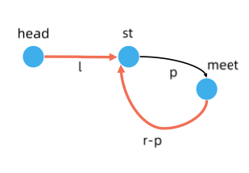

# 环形链表
- [环形链表](https://leetcode.cn/problems/linked-list-cycle/solution/yi-wen-gao-ding-chang-jian-de-lian-biao-wen-ti-h-2/)
- [环形链表 II](https://leetcode.cn/problems/linked-list-cycle-ii/)

# 解题思路
当一个链表有环时，快慢指针都会陷入环中进行无限次移动，然后变成了追及问题。想象一下在操场跑步的场景，只要一直跑下去，快的总会追上慢的。当两个指针都进入环后，每轮移动使得慢指针到快指针的距离增加一，同时快指针到慢指针的距离也减少一，只要一直移动下去，快指针总会追上慢指针。


```cpp
/**
 * Definition for singly-linked list.
 * struct ListNode {
 *     int val;
 *     ListNode *next;
 *     ListNode(int x) : val(x), next(NULL) {}
 * };
 */
class Solution {
public:
    bool hasCycle(ListNode *head) {
        auto fast = head;
        while (fast != nullptr && fast->next != nullptr)
        {
            fast = fast->next->next;
            head = head->next;
            if (head == fast) return true;
        }
        return false;
    }
};
```


```cpp
/**
 * Definition for singly-linked list.
 * struct ListNode {
 *     int val;
 *     ListNode *next;
 *     ListNode(int x) : val(x), next(NULL) {}
 * };
 */
class Solution {
public:
    bool hasCycle(ListNode *head) {
        if (!head || !head->next) return false;
        auto s = head, f = head->next;
        while (f) {
            s = s->next, f = f->next;
            if (!f) return false;
            f = f->next;
            if (s == f) return true;
        }
        return false;
    }
};
```

- 返回环的入口？


  - 相遇时,`slow`走了$l+p$，`fast`走了$2(l+p)$,路程之差即圈长$r$的整数倍$k$
    $2(l+p)-(l+p)=+k\times r$
    即
    $l=k\times r-p=(k-1)\times r+(r-p)$
  - **含义：从`head`走向`st`等于从`meet`走到`st`然后绕几圈**
  - 此时让`slow` `fast`同速移动，必然在开头相遇
```cpp
/**
 * Definition for singly-linked list.
 * struct ListNode {
 *     int val;
 *     ListNode *next;
 *     ListNode(int x) : val(x), next(NULL) {}
 * };
 */
class Solution {
public:
    ListNode *detectCycle(ListNode *head) {
        auto fast = head;
        auto slow = head;
        while (fast != nullptr && fast->next != nullptr)
        {
            fast = fast->next->next;
            slow = slow->next;
            if (fast == slow)
            {
                while (head != slow)
                {
                    head = head->next;
                    slow = slow->next;
                }
                return head;
            }
        }
        return nullptr;
    }
};
```


```cpp
/**
 * Definition for singly-linked list.
 * struct ListNode {
 *     int val;
 *     ListNode *next;
 *     ListNode(int x) : val(x), next(NULL) {}
 * };
 */
class Solution {
public:
    ListNode *detectCycle(ListNode *head) {
        if (!head || !head->next) return NULL;
        auto s = head, f = head->next;
        while (f) {
            s = s->next, f = f->next;
            if (!f) return NULL;
            f = f->next;
            if (s == f) {
                s = head, f = f->next;
                while (s != f) s = s->next, f = f->next;
                return s;
            }
        }
        return NULL;
    }
};
```