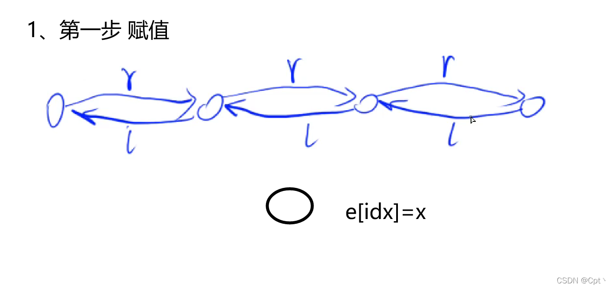
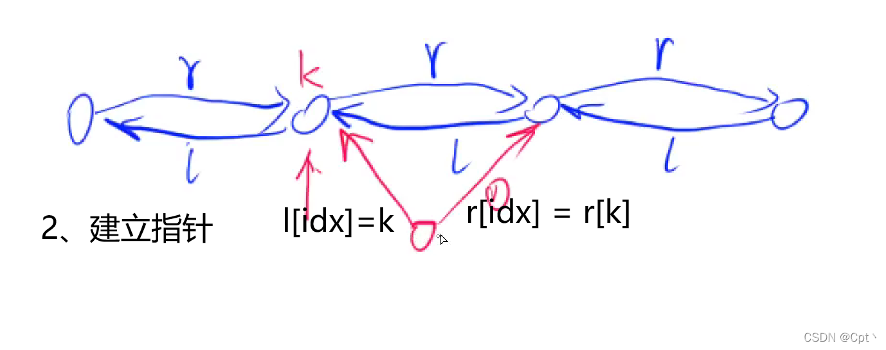
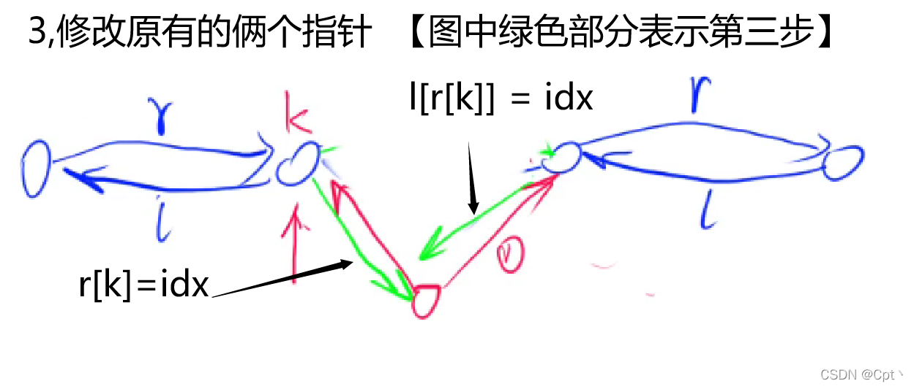
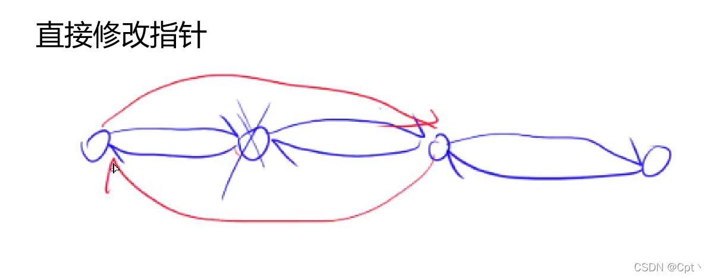

# 双链表
- 数组模拟双链表
  - 结构定义
    ```cpp
    int e[N], ne[N], head, idx;
    ```
  - 初始化
    ```cpp
    void init()
    {
        l[0] = 1;
        r[1] = 0;
        idx = 2;
    }
    ```
  - 添加
  
  
  
    - `add()`
    ```cpp
    void add(int k, int x)
    {
        e[idx] = x;
        r[idx] = r[k];
        l[idx] = k;
        l[r[k]] = idx;
        r[k] = idx;
        idx ++;
    }
    ```
    - `add_head()`
    ```cpp
    add(0, x);
    ```
    - `add_tail()`
    ```cpp
    add(l[1], x);
    ```
    - `add_left()`
    ```cpp
    add(l[k], x);
    ```
    
  - 删除
    

    - `remove`
    ```cpp
    void remove(int k)
    {
        l[r[k]] = l[k];
        r[l[k]] = r[k];
    }
    ```
  - 遍历 
    ```cpp
    for (int i = r[0]; i != 1; i = r[i]) 
        cout << e[i] << ' ';
    ```

# Code
```cpp
#include <iostream>

using namespace std;

const int N = 100010;

int m;
int e[N], l[N], r[N], idx;

void init()
{
    l[0] = 1;
    r[1] = 0;
    idx = 2;
}

void remove(int k)
{
    l[r[k]] = l[k];
    r[l[k]] = r[k];
}

void add(int k, int x)
{
    e[idx] = x;
    r[idx] = r[k];
    l[idx] = k;
    l[r[k]] = idx;
    r[k] = idx;
    idx ++;
}

int main()
{
    cin >> m;

    init();

    while (m -- )
    {
        string op;
        cin >> op;
        int k, x;
        if (op == "L")
        {
            cin >> x;
            add(0, x);
        }
        else if (op == "R")
        {
            cin >> x;
            add(l[1], x);
        }
        else if (op == "D")
        {
            cin >> k;
            remove(k + 1);
        }
        else if (op == "IL")
        {
            cin >> k >> x;
            add(l[k + 1], x);
        }
        else
        {
            cin >> k >> x;
            add(k + 1, x);
        }
    }

    for (int i = r[0]; i != 1; i = r[i]) cout << e[i] << ' ';
    cout << endl;

    return 0;
}
```
