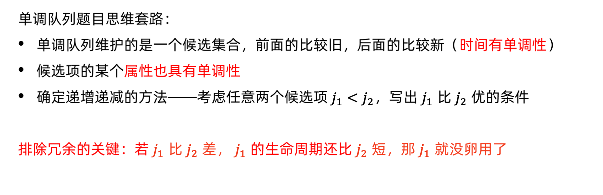
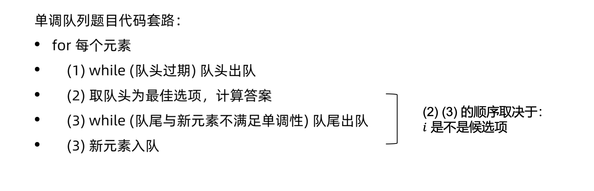

# 滑动窗口
[AcWing 154. 滑动窗口](https://www.acwing.com/problem/content/156/)

# 单调队列原理
剔除不可能成为答案的元素，从而对朴素算法进行加速

# 套路





# 模板
常见模型：找出滑动窗口中的最大值/最小值
```cpp
for (int i = 0; i < n; i ++ )
{
    while (hh <= tt && check_out(q[hh])) hh ++ ;  // 判断队头是否滑出窗口
    while (hh <= tt && check(q[tt], i)) tt -- ;  //剔除不可能成为答案的元素
    q[ ++ tt] = i; //入队
}
```

# 解题思路
若求每个滑动窗口的最大值，朴素的做法是遍历每个窗口中的元素，那么有没有一些数据是永远不可能成为答案呢？

比如说窗口 `{4 1 3}`，$3$ 比 $1$ 大还后出队
也就是说，当 $3$ 入队时，$1$ 永远不可能成为答案

当发现存在逆序的元素，则会不断删除队尾元素使得该队列单调

根据队列的单调性定义，队首元素为该窗口最大值

### 具体操作
以求最大值为例：

- 如果当前的滑动窗口中有两个下标 `i` 和 `j` ，其中`i`在`j`的左侧（`i`<`j`），并且`i`对应的元素不大于`j`对应的元素（`nums[i]`≤`nums[j]`），则：

   当滑动窗口向右移动时，只要 `i` 还在窗口中，那么 `j` 一定也还在窗口中。这是由于 `i` 在 `j` 的左侧所保证的。

   **因此，由于 `nums[j]` 的存在，`nums[i]` 一定不会是滑动窗口中的最大值了，我们可以将`nums[i]`永久地移除**

- 因此我们可以使用一个队列存储所有还没有被移除的下标。在队列中，这些下标按照从小到大的顺序被存储，并且它们在数组`nums`中对应的值是严格单调递减的。

- 当滑动窗口向右移动时，我们需要把一个新的元素放入队列中。

  为了保持队列的性质，我们会不断地将新的元素与队尾的元素相比较，如果新元素大于等于队尾元素，那么队尾的元素就可以被永久地移除，我们将其弹出队列。我们需要不断地进行此项操作，直到队列为空或者新的元素小于队尾的元素。

- 由于队列中下标对应的元素是严格单调递减的，因此此时队首下标对应的元素就是滑动窗口中的最大值。

- 窗口向右移动的时候。因此我们还需要不断从队首弹出元素保证队列中的所有元素都是窗口中的，因此当队头元素在窗口的左边的时候，弹出队头。

# Code
```cpp
#include <iostream>

using namespace std;

const int N = 1000010;

int a[N], q[N];
int hh = 0, tt = -1;

int main()
{
    int n, k;
    cin >> n >> k;
    for (int i = 0; i < n; i ++) scanf("%d", &a[i]);
    //最小值
    for (int i = 0; i < n; i ++)
    {
        //维持滑动窗口的大小
        //当队列不为空(hh <= tt) 且 当当前滑动窗口的大小(i - q[hh] + 1)>我们设定的
        //滑动窗口的大小(k),队列弹出队列头元素以维持滑动窗口的大小
        while (hh <= tt && i - q[hh] + 1 > k) hh ++;
        //构造单调递增队列
        //当队列不为空(hh <= tt) 且 当队列队尾元素>=当前元素(a[i])时,那么队尾元素
        //就一定不是当前窗口最小值,删去队尾元素,加入当前元素(q[ ++ tt] = i)
        while (hh <= tt && a[q[tt]] >= a[i]) tt --;
        q[++ tt] = i;
        if (i + 1 >= k) printf("%d ", a[q[hh]]);
    }
    puts("");
    hh = 1, tt = 0;
    //最大值
    for (int i = 0; i < n; i ++)
    {
        while (hh <= tt && i - q[hh] + 1 > k) hh ++;
        while (hh <= tt && a[q[tt]] <= a[i]) tt --;
        q[++ tt] = i;
        if (i + 1 >= k) printf("%d ", a[q[hh]]);
    }
    return 0;
}
```