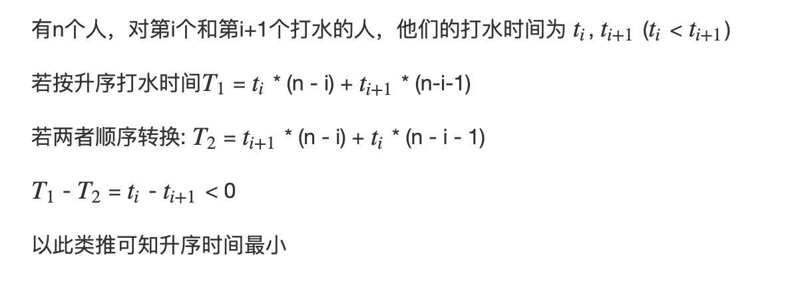

# 排队打水
[AcWing 913. 排队打水](https://www.acwing.com/problem/content/description/915/)

# 解题思路
**直觉**
- 安排他们的打水顺序才能使所有人的等待时间之和最小，则需要将打水时间最短的人先打水

**证明**




### Code
```cpp
#include <iostream>
#include <algorithm>

using namespace std;

const int N = 100010;

int n, ans;
int a[N];

typedef long long LL;

int main()
{
    cin >> n;
    for (int i = 0; i < n; i ++) cin >> a[i];
    sort(a, a + n);
    LL res = 0, t = 0;
    for (int i = 0; i < n; i ++) res += t, t += a[i];
    cout << res;
    return 0;
}
```