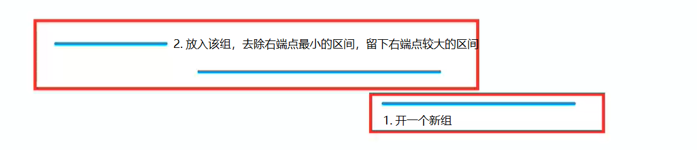

# 区间分组
[AcWing 906. 区间分组](https://www.acwing.com/problem/content/description/908/)

# 解题思路1

有若干个活动，第i个活动开始时间和结束时间是 $[S_i,f_i]$ ，同一个教室安排的活动之间不能交叠，求要安排所有活动，少需要几个教室？

有时间冲突的活动不能安排在同一间教室，与该问题的限制条件相同，即最小需要的教室个数即为该题答案。

我们可以把所有开始时间和结束时间排序，遇到开始时间就把需要的教室加 $1$ ，遇到结束时间就把需要的教室减 $1$ ,在一系列需要的教室个数变化的过程中，峰值就是多同时进行的活动数，也是我们至少需要的教室数

### Code
```cpp
#include <iostream>
#include <algorithm>

using namespace std;

const int N = 100010;

int n;
int b[N * 2], idx;

int main()
{
    scanf("%d", &n);
    for (int i = 0; i < n; i ++ )
    {
        int l, r;
        scanf("%d%d", &l, &r);
        b[idx ++] = l * 2;
        b[idx ++] = r * 2 + 1;
    }

    sort(b, b + idx);

    int res = 1, t = 0;
    for (int i = 0; i < idx; i ++)
    {
        if (b[i] % 2 == 0) t ++;
        else t --;
        res = max(res, t);
    }
    cout << res;
    return 0;
}
```

# 解题思路2



贪心决策
从前往后枚举每个区间，判断此区间能否将其放到现有的组中

如果一个区间的左端点比最小组的右端点要小，`ranges[i].l<=heap.top()` ， 就开一个新组 `heap.push(range[i].r)`;

如果一个区间的左端点比最小组的右端点要大，则放在该组，`heap.pop(),heap.push(range[i].r);`

每组去除右端点最小的区间，只保留一个右端点较大的区间，这样`heap`有多少区间，就有多少组。

### Code

```cpp
#include <iostream>
#include <algorithm>
#include <queue>

using namespace std;

const int N = 100010;

int n;
struct Range
{
    int l, r;
    bool operator< (const Range &W)const
    {
        return l < W.l;
    }
}range[N];

int main()
{
    scanf("%d", &n);
    for (int i = 0; i < n; i ++ )
    {
        int l, r;
        scanf("%d%d", &l, &r);
        range[i] = {l, r};
    }

    sort(range, range + n);

    priority_queue<int, vector<int>, greater<int>> heap;
    for (int i = 0; i < n; i ++ )
    {
        auto r = range[i];
        if (heap.empty() || heap.top() >= r.l) heap.push(r.r);
        else
        {
            heap.pop();
            heap.push(r.r);
        }
    }

    printf("%d\n", heap.size());
    return 0;
}
```