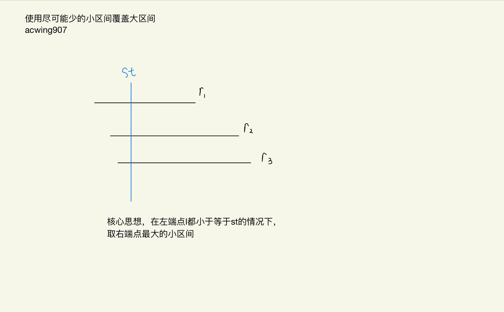

# 区间覆盖
[AcWing 907. 区间覆盖](https://www.acwing.com/problem/content/description/909/)

# 解题思路



- 将所有区间按照左端点从小到大进行排序

- 从前往后枚举每个区间，在所有能覆盖 `start` 的区间中，选择右端点的最大区间，然后将 `start` 更新成右端点的最大值

### Code
```cpp
#include <iostream>
#include <algorithm>
#define l first
#define r second

using namespace std;

typedef pair<int, int> PII;

const int N = 100010;
PII a[N];
int st, ed, n;

int main()
{
    cin >> st >> ed >> n;
    for (int i = 0; i < n; i ++)
    {
        int l, r;
        cin >> l >> r;
        a[i] = {l, r};
    }
    
    sort(a, a + n);
    
    int res = 0;
    bool success = false;
    for (int i = 0; i < n; i ++)
    {
        int j = i, r = -2e9;
        while (j < n && st >= a[j].l) 
        {
            r = max(r, a[j].r);
            j ++;
        }
        
        if (r < st)
        {
            res = -1;
            break;
        }
        
        res ++;
        
        if (r >= ed)
        {
            success = true;
            break;
        }
        
        st = r;
        i = j - 1;
    }
    
    if (!success) res = -1;
    printf("%d\n", res);
    
    return 0;
}
```

