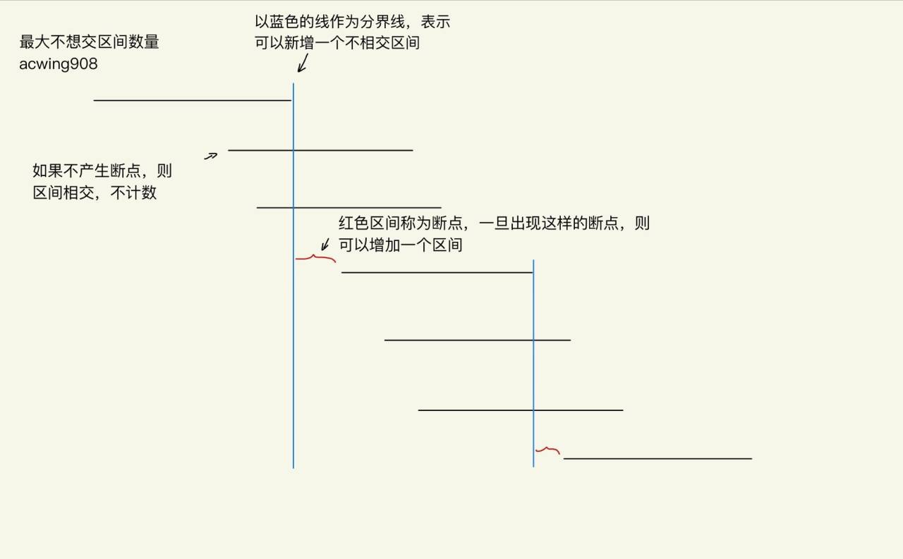

# 最大不相交区间数量
[AcWing 908. 最大不相交区间数量](https://www.acwing.com/problem/content/910/)

# 解题思路



### Code
```cpp
#include <iostream>
#include <algorithm>
#include <vector>
#define l first
#define r second

using namespace std;

typedef pair<int, int> PII;

const int N = 10010;
vector<PII> a;
int res, n;


int main()
{
    cin >> n;
    for (int i = 0; i < n; i ++)
    {
        int l, r;
        cin >> l >> r;
        a.push_back({l, r});
    }
    
    sort(a.begin(), a.end(), [&](PII& a, PII& b){
        return a.r < b.r;
    });
    
    for (int i = 0, j = 0; i < n; i ++)
    {
        while (j < n && a[j].l <= a[i].r) j ++;
        res ++, i = j - 1;
    }
    cout << res << endl;
    return 0;
}
```
```cpp
#include <iostream>
#include <algorithm>

using namespace std;

const int N = 100010;

int n;
struct Range
{
    int l, r;
    bool operator< (const Range &W)const
    {
        return r < W.r;
    }
}range[N];

int main()
{
    scanf("%d", &n);
    for (int i = 0; i < n; i ++ ) scanf("%d%d", &range[i].l, &range[i].r);

    sort(range, range + n);

    int res = 0, ed = -2e9;
    for (int i = 0; i < n; i ++ )
        if (ed < range[i].l)
        {
            res ++ ;
            ed = range[i].r;
        }

    printf("%d\n", res);

    return 0;
}
```