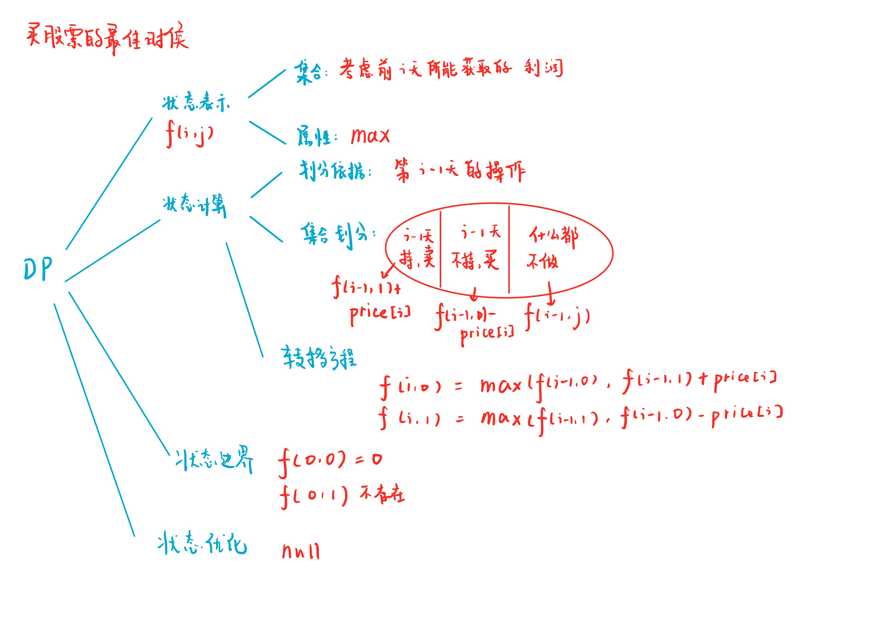

# LeetCode 122. 买卖股票的最佳时机 II
[LeetCode 122. 买卖股票的最佳时机 II](https://leetcode.cn/problems/best-time-to-buy-and-sell-stock-ii/)

# 解题思路1
遍历一次数组，低进高出，把正的价格差相加起来就是最终利润

递增，如`[1,2,3]`，那么 $1$ 买 $3$ 卖 与 每天都买入卖出 等价
递减，如`[3,2,1]`，赚钱是赚不了的
先高再低，如`[1,3,2]`，那么只能在 $1$ 买 $3$ 卖捞一笔
先低再高，如`[2,1,3]`，那么同样只能在$1$ 买 $3$ 卖捞一笔

### Code
```cpp
class Solution {
public:
    int maxProfit(vector<int>& prices) {
        int ans = 0;
        for (int i = 1; i < prices.size(); i ++)
            if (prices[i] - prices[i - 1] > 0)
                ans += prices[i] - prices[i - 1];
        return ans;
    }
};
```

# 解题思路2
动态规划



### Code
```cpp
class Solution {
public:
    int maxProfit(vector<int>& prices) {
        int n = prices.size();
        prices.insert(prices.begin(), 0);
        vector<vector<int>> f(n + 1, vector<int>(2, -1e9));
        f[0][0] = 0;
        for (int i = 1; i <= n; i ++)
        {
            f[i][1] = max(f[i][1], f[i - 1][0] - prices[i]);
            f[i][0] = max(f[i][0], f[i - 1][1] + prices[i]);
            for (int j = 0; j < 2; j ++)
                f[i][j] = max(f[i][j], f[i - 1][j]);
        }
        return f[n][0];
    }
};
```

### 由动态规划到贪心
$f[i-1][1] 的估值是 f[i-1][0] - price[i-1]$

比较
- $f[i-1][1] + price[i] 的估值是 f[i-1][0] - price[i-1] + price[i]$
- $f[i-1][0]$

当 $price[i]-price[i-1]>0$ 时，卖出肯定是最优
同理，$price[i]-price[i-1]<0$，买入肯定是最优


