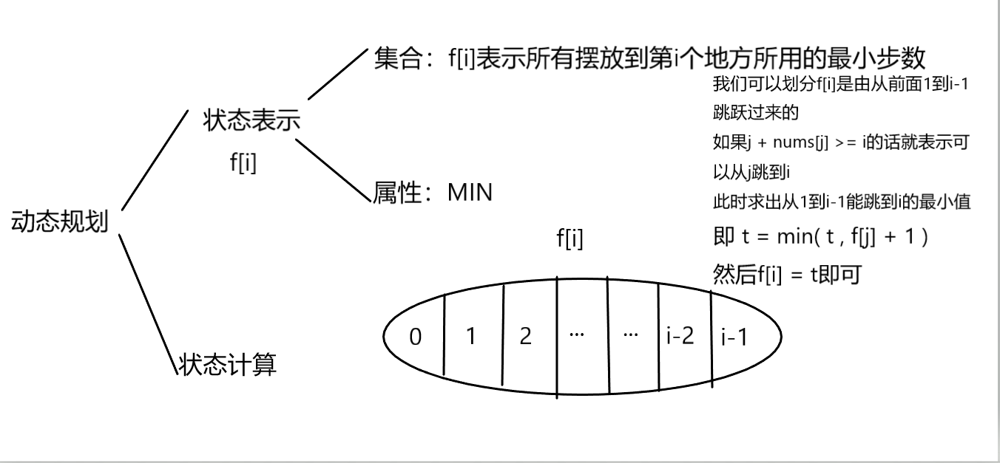

# 跳跃游戏 II 
[LeetCode 45. 跳跃游戏 II ](https://leetcode.cn/problems/jump-game-ii/)

# 解题思路
动态规划


### Code
```cpp
class Solution {
public:
    int jump(vector<int>& nums) {
        int n = nums.size();
        vector<int> f(n + 1, 0x3f3f3f3f);
        f[0] = 0;
        for (int i = 1; i < n; i ++)
            for (int j = 0; j < i; j ++)
                if (j + nums[j] >= i)
                    f[i] = min(f[i], f[j] + 1);
                    
        return f[n - 1];
    }
};
```

### 贪心优化
我们会发现 $f[i]$ 是具有单调性的，也就是 $f[i + 1] >= f[i]$ 。

用反证法：假设 $f[i + 1] < f[i]$ ，不妨设是从 $k$,$(k <= i)$ 点跳到 $i + 1$ ，即： $k + nums[k] >= i + 1$ ，那么 $k + nums[k]$ 也必然大于 $i$ ，此时：$f[i + 1] = f[i]$ 了。

如果 $nums$ 数组每一项都为 $1$，则：$f[i + 1] > f[i]$，

综上：$f[i + 1] >= f[i]$，与假设矛盾。

因此 $f[i]$ 就变成了`0 1...1 2...2 3...3 ......`，在动态规划时瓶颈就在于更新每个点的最小值时需要遍历所有能跳到 $i$ 的点，而有了单调性以后就可以用第一个能跳到$i$ 的点更新了，这里无论是取哪一个点跳到 $i$ ，其最终的结果是一样的，但是取第一个点和取最后一个点所需要的步数可能不相同，所以尽量选择靠前的点，这样步数就可能会减少，贪心的思想

为什么是第一个能跳到的点直接更新就行了而不是其他比如最后一个点呢？

- 因为第一个和最后一个点都能跳到点 $i$ 也就是说结果是一样的 但是 他们的步数可能不相同 所以尽量找前面的点 这样步数就越少 也是贪心的思想吧

### Code
```cpp
class Solution {
public:
    int jump(vector<int>& nums) {
        int n = nums.size();
        vector<int> f(n + 1, 0x3f3f3f3f);
        f[0] = 0;
        for (int i = 1, j = 0; i < n; i ++)
        {
            while (j < n && j + nums[j] < i) j ++;
            f[i] = f[j] + 1;
        }

        return f[n - 1];
    }
};
```


