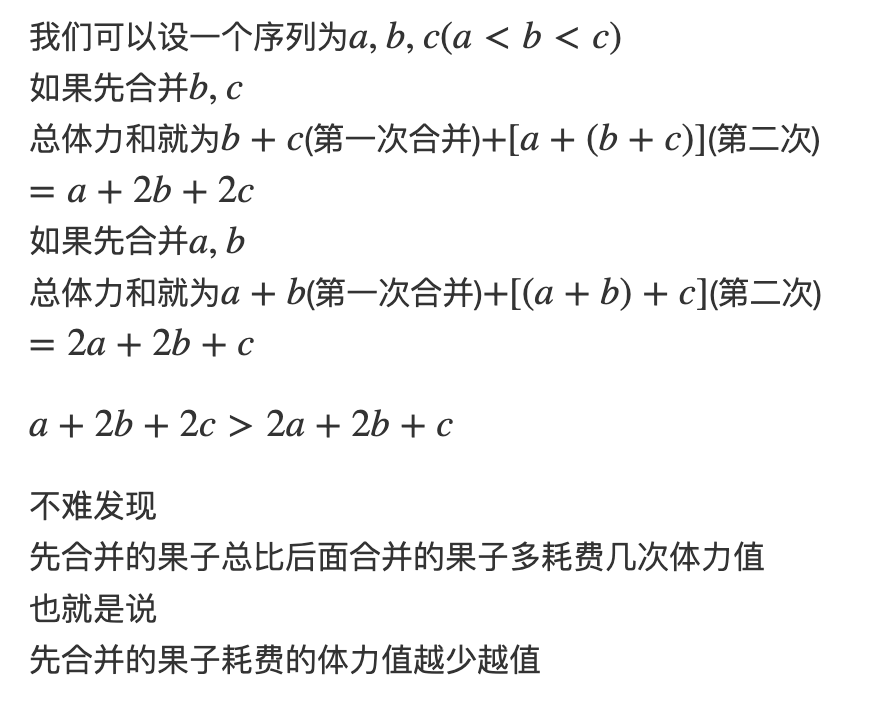

# 合并果子
[AcWing 148. 合并果子](https://www.acwing.com/problem/content/150/)


# 解题思路

经典哈夫曼树的模型，每次合并重量最小的两堆果子即可

使用小根堆维护所有果子，每次弹出堆顶的两堆果子，并将其合并，合并之后将两堆重量之和再次插入小根堆中

每次操作会将果子的堆数减一，一共操作 $n−1$  次即可将所有果子合并成 $1$ 堆。每次操作涉及到 $2$ 次堆的删除操作和1次堆的插入操作，计算量是 $O(logn)$ 。因此总时间复杂度是 $O(nlogn)$

**证明**




### Code
```cpp

```
