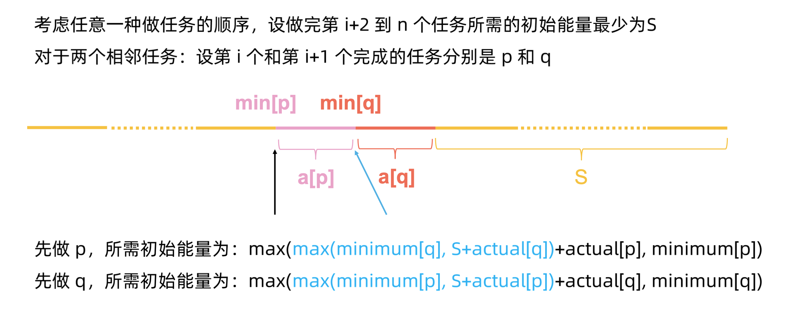
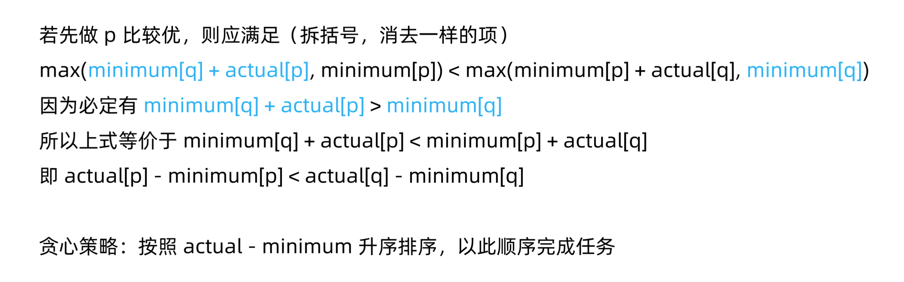

# LeetCode 1665. 完成所有任务的最少初始能量

# 解题思路
直觉上来看
- 要求越苛刻的越先解决
- 消耗越少的越先解决

所以，按 `actual - minimal` 为关键字排序

证明：





### Code
```cpp
class Solution {
public:
    int minimumEffort(vector<vector<int>>& tasks) {
        sort(tasks.begin(), tasks.end(), [&](vector<int>& a, vector<int>& b){
            return a[0] - a[1] > b[0] - b[1];
        });

        int ans = 0;
        for (auto i : tasks) ans = max(ans + i[0], i[1]);
        return ans;
    }
};
```