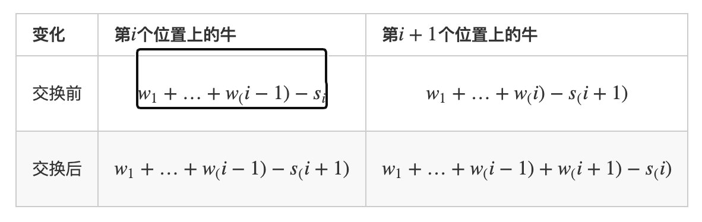
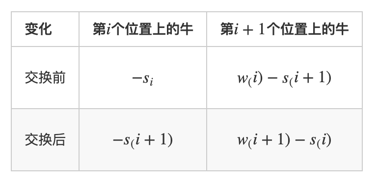
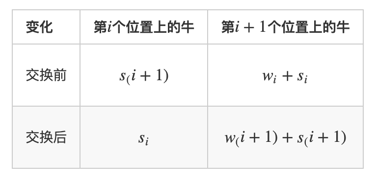
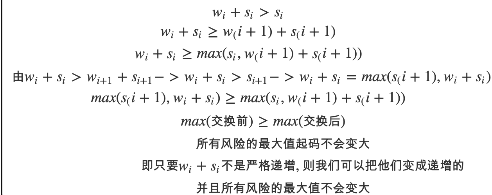

# 耍杂技的牛
[AcWing 125. 耍杂技的牛](https://www.acwing.com/problem/content/127/)

# 解题思路
直觉上看
- 重量小的放上面
- 承载能力强的放下面

所以，以`s + w`为关键字升序排序

证明：

如果不是按`S[i]+W[i]`从小到大排序一定存在相邻 $i$ 和 $i+1$ 有$w_i+s_i>w_{i+1}+s_{i+1}$

- 可以发现此时交换第 $i$ 头牛和第 $i+1$ 头牛不影响 $[0,i−1]$ 和 $[i+2,n]$ 的风险



- 前 $i−1$ 项减去



- 加上 $s_i + s_{i+1}$






### Code
```cpp
#include <iostream>
#include <vector>
#include <algorithm>

using namespace std;

const int N = 10010;
typedef pair<int, int> PII;

int n;
vector<PII> cow;

int main()
{
    cin >> n;
    while (n --)
    {
        int s, w;
        cin >> w >> s;
        cow.push_back({w, s});
    }
    
    sort(cow.begin(), cow.end(), [&](PII& a, PII& b){
        return a.first + a.second < b.first + b.second;
    });
    
    int ans = -0x3f3f3f3f, weight = 0;
    for (auto i : cow)
    {
        ans = max(ans, weight - i.second);
        weight += i.first;
    }
    cout << ans;
    return 0;
}
```