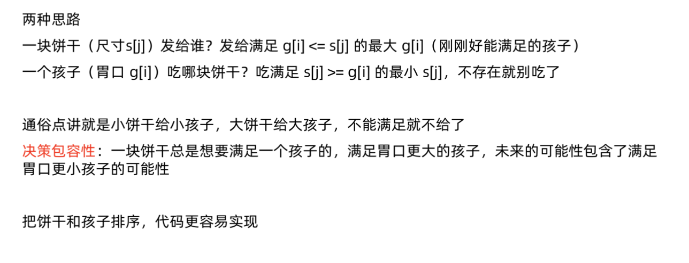
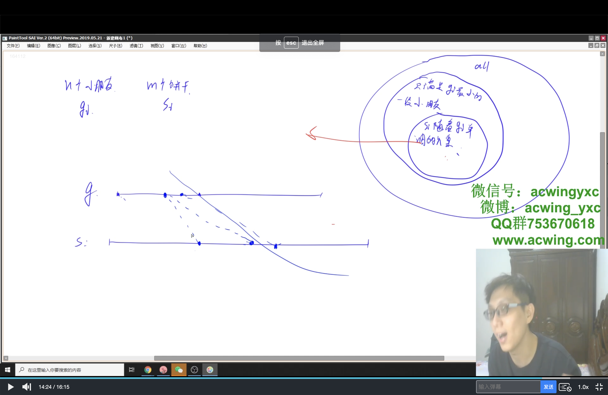

# 分发饼干
[LeetCode 455. 分发饼干](https://leetcode.cn/problems/assign-cookies/)

# 解题思路



分别将孩子的贪心指数和饼干尺寸都从小到大排序。
定义 $i$ 和 $j$ 从 $0$ 开始，代表尝试将第 $j$ 块饼干分配给第 $i$ 个孩子。若 $sj_>=g_i$，则答案加 $1$，$i$ 和 $j$ 都向后移动；否则 $j$ 向后移动。




### Code
```cpp
class Solution {
public:
    int findContentChildren(vector<int>& g, vector<int>& s) {
        //g[i] <= s[j] 的 i 都可以满足
        //g[i1] <= g[i2] <= s[j] 时，满足i2更好
        sort(g.begin(), g.end());
        sort(s.begin(), s.end());
        int res = 0;
        for (int i = 0, j = 0; i < g.size(); i ++)
        {
            while (j < s.size() && g[i] > s[j]) j ++;
            if (j != s.size()) res ++, j ++;
            else break;
        }

        return res;
    }
};
```


