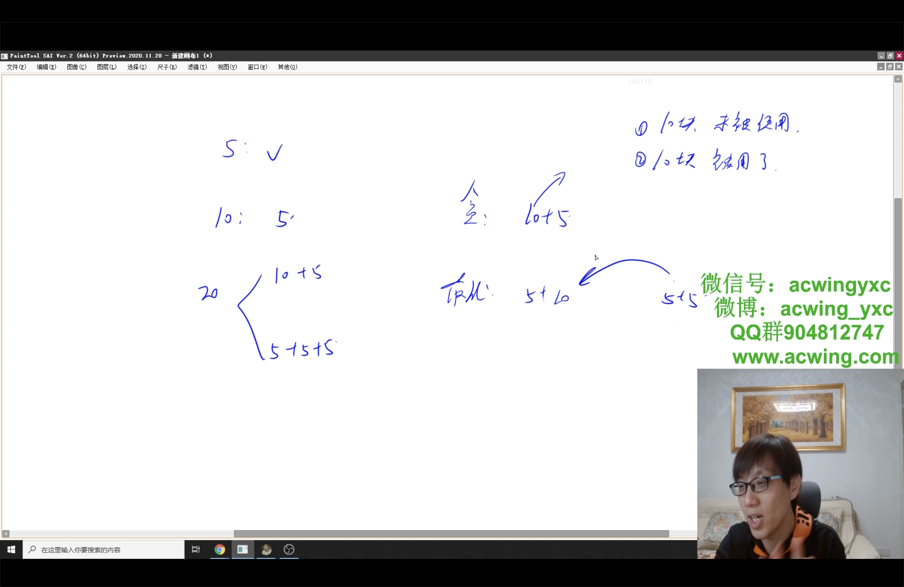
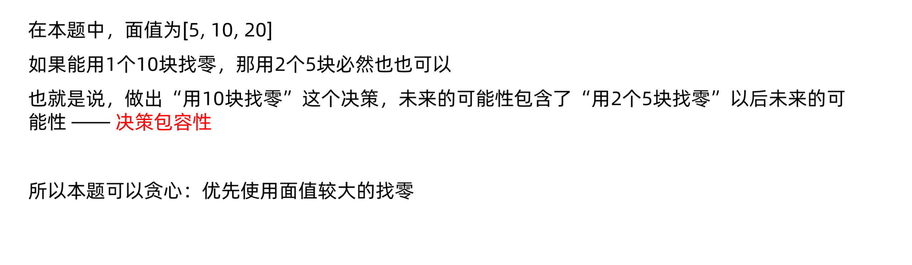

# 柠檬水找零
[LeetCode 860. 柠檬水找零](https://leetcode.cn/problems/lemonade-change/)

# 解题思路
贪心证明：
**决策包容性**





- 开两个变量记录手中 $5$ 元和 $10$ 元的数量。
- 收到 $5$ 元，直接增加一张 $5$ 元；
- 收到 $10$ 元，如果没有 $5$ 元了，则返回 `false`；
- 收到 $20$ 元，则如果有 $10$ 元的，并且也有至少一张 $5$ 元的，则优先将 $10$ 元配 $5$ 元纸币的找回（因为 $5$ 元的可以更灵活）；如果没有 $10$ 元的，但 $5$ 元的有三张，则直接找回三张 $5$ 元的。否则，无法找零，返回 `false`

### Code
```cpp
class Solution {
public:
    unordered_map<int, int> cnt;
    bool lemonadeChange(vector<int>& bills) {
        for (auto i : bills)
        {
            cnt[i] ++;
            if (!exchange(i - 5)) return false;
        }
        return true;
    }

    bool exchange(int val)
    {
        for (auto i : {20, 10, 5})
            while (val >= i && cnt[i] > 0)
            {
                val -= i;
                cnt[i] --;
            }
        return val == 0;
    }
};
```

```cpp
class Solution {
public:
    bool lemonadeChange(vector<int>& bills) {
        int five = 0, ten = 0;
        for (auto x: bills) {
            if (x == 5) five ++ ;
            else if (x == 10) {
                if (!five) return false;
                five -- ;
                ten ++ ;
            } else {
                if (ten && five) ten --, five -- ;
                else if (five >= 3) five -= 3;
                else return false;
            }
        }
        return true;
    }
};
```